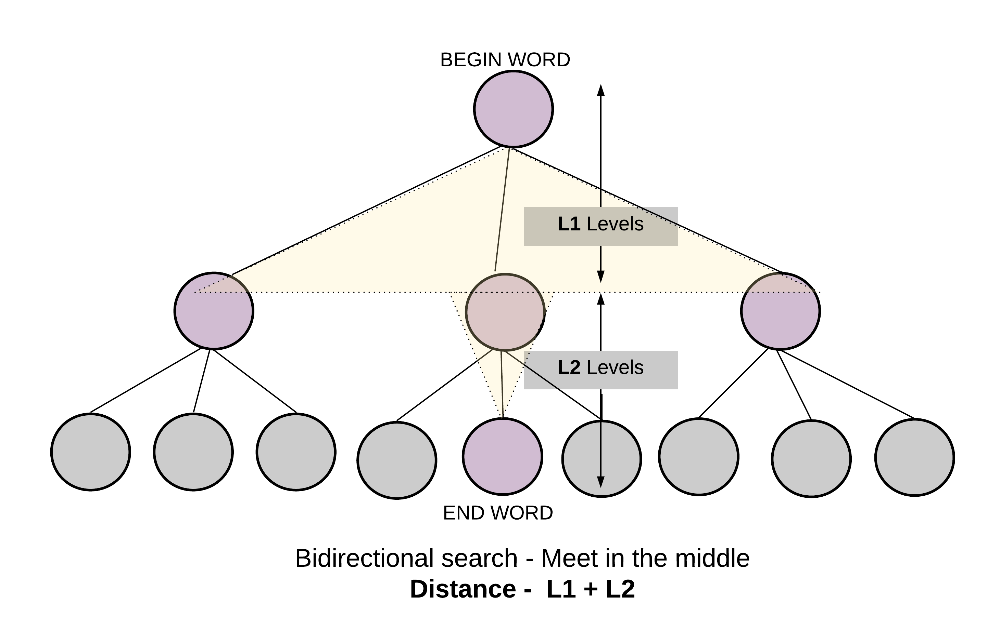

### [127. Word Ladder](https://leetcode.com/problems/word-ladder/)


Given two words (beginWord and endWord), and a dictionary's word list, find the length of shortest transformation sequence from beginWord to endWord, such that:

   1. Only one letter can be changed at a time.
   2. Each transformed word must exist in the word list.
Note:

   - Return 0 if there is no such transformation sequence.
   - All words have the same length.
   - All words contain only lowercase alphabetic characters.
   - You may assume no duplicates in the word list.
   - You may assume beginWord and endWord are non-empty and are not the same.

Example 1:
```
Input:
beginWord = "hit",
endWord = "cog",
wordList = ["hot","dot","dog","lot","log","cog"]

Output: 5

Explanation: As one shortest transformation is "hit" -> "hot" -> "dot" -> "dog" -> "cog",
return its length 5.
```

Example 2:
```
Input:
beginWord = "hit"
endWord = "cog"
wordList = ["hot","dot","dog","lot","log"]

Output: 0

Explanation: The endWord "cog" is not in wordList, therefore no possible transformation.
```

Solution

<p>We are given a <code>beginWord</code> and an <code>endWord</code>. Let these two represent <code>start node</code> and <code>end node</code> of a graph. We have to reach from the start node to the end node using some intermediate nodes/words. The intermediate nodes are determined by the <code>wordList</code> given to us. The only condition for every step we take on this ladder of words is the current word should change by just <code>one letter</code>.</p>


<p>We will essentially be working with an undirected and unweighted graph with words as nodes and edges between words which differ by just one letter. The problem boils down to finding the shortest path from a start node to a destination node, if there exists one. Hence it can be solved using <code>Breadth First Search</code> approach.</p>


<p>This pre-processing helps to form generic states to represent a single letter change.</p>

<p>For e.g. <code>Dog ----&gt; D*g &lt;---- Dig</code></p>

<p>Both <code>Dog</code> and <code>Dig</code> map to the same intermediate or generic state <code>D*g</code>.</p>

<p>The preprocessing step helps us find out the generic one letter away nodes for any word of the word list and hence making it easier and quicker to get the adjacent nodes. Otherwise, for every word we will have to iterate over the entire word list and find words that differ by one letter. That would take a lot of time. This preprocessing step essentially builds the adjacency list first before beginning the breadth first search algorithm.</p>

<p>For eg. While doing BFS if we have to find the adjacent nodes for <code>Dug</code> we can first find all the generic states for <code>Dug</code>.</p>

<ol>
<li><code>Dug =&gt; *ug</code></li>
<li><code>Dug =&gt; D*g</code></li>
<li><code>Dug =&gt; Du*</code></li>
</ol>

<p>The second transformation <code>D*g</code> could then be mapped to <code>Dog</code> or <code>Dig</code>, since all of them share the same generic state. Having a common generic transformation means two words are connected and differ by one letter.</p>

<h4 id="approach-1-breadth-first-search">Approach 1: Breadth First Search</h4>

<p><strong>Intuition</strong></p>

<p>Start from <code>beginWord</code> and search the <code>endWord</code> using BFS.</p>

<p><strong>Algorithm</strong></p>

<ol>
<li>
<p>Do the pre-processing on the given <code>wordList</code> and find all the possible generic/intermediate states. Save these intermediate states in a dictionary with key as the intermediate word and value as the list of words which have the same intermediate word.</p>
</li>
<li>
<p>Push a tuple containing the <code>beginWord</code> and <code>1</code> in a queue. The <code>1</code> represents the level number of a node. We have to return the level of the <code>endNode</code> as that would represent the shortest sequence/distance from the <code>beginWord</code>.</p>
</li>
<li>
<p>To prevent cycles, use a visited dictionary.</p>
</li>
<li>
<p>While the queue has elements, get the front element of the queue. Let's call this word as <code>current_word</code>.</p>
</li>
<li>
<p>Find all the generic transformations of the <code>current_word</code> and find out if any of these transformations is also a transformation of other words in the word list. This is achieved by checking the <code>all_combo_dict</code>.</p>
</li>
<li>
<p>The list of words we get from <code>all_combo_dict</code> are all the words which have a common intermediate state with the <code>current_word</code>. These new set of words will be the adjacent nodes/words to <code>current_word</code> and hence added to the queue.</p>
</li>
<li>
<p>Hence, for each word in this list of intermediate words, append <code>(word, level + 1)</code> into the queue where <code>level</code> is the level for the <code>current_word</code>.</p>
</li>
<li>
<p>Eventually if you reach the desired word, its level would represent the shortest transformation sequence length.</p>
<blockquote>
<p>Termination condition for standard BFS is finding the end word.</p>
</blockquote>
</li>
</ol>

```java
class Solution {
  public int ladderLength(String beginWord, String endWord, List<String> wordList) {

    // Since all words are of same length.
    int L = beginWord.length();

    // Dictionary to hold combination of words that can be formed,
    // from any given word. By changing one letter at a time.
    Map<String, List<String>> allComboDict = new HashMap<>();

    wordList.forEach(
        word -> {
          for (int i = 0; i < L; i++) {
            // Key is the generic word
            // Value is a list of words which have the same intermediate generic word.
            String newWord = word.substring(0, i) + '*' + word.substring(i + 1, L);
            List<String> transformations = allComboDict.getOrDefault(newWord, new ArrayList<>());
            transformations.add(word);
            allComboDict.put(newWord, transformations);
          }
        });

    // Queue for BFS
    Queue<Pair<String, Integer>> Q = new LinkedList<>();
    Q.add(new Pair(beginWord, 1));

    // Visited to make sure we don't repeat processing same word.
    Map<String, Boolean> visited = new HashMap<>();
    visited.put(beginWord, true);

    while (!Q.isEmpty()) {
      Pair<String, Integer> node = Q.remove();
      String word = node.getKey();
      int level = node.getValue();
      for (int i = 0; i < L; i++) {

        // Intermediate words for current word
        String newWord = word.substring(0, i) + '*' + word.substring(i + 1, L);

        // Next states are all the words which share the same intermediate state.
        for (String adjacentWord : allComboDict.getOrDefault(newWord, new ArrayList<>())) {
          // If at any point if we find what we are looking for
          // i.e. the end word - we can return with the answer.
          if (adjacentWord.equals(endWord)) {
            return level + 1;
          }
          // Otherwise, add it to the BFS Queue. Also mark it visited
          if (!visited.containsKey(adjacentWord)) {
            visited.put(adjacentWord, true);
            Q.add(new Pair(adjacentWord, level + 1));
          }
        }
      }
    }

    return 0;
  }
}
```

<p><strong>Complexity Analysis</strong></p>

<ul>
<li>
<p>Time Complexity: <span class="katex"><span class="katex-mathml"><math><semantics><mrow><mi>O</mi><mo>(</mo><msup><mi>M</mi><mn>2</mn></msup><mo>×</mo><mi>N</mi><mo>)</mo></mrow><annotation encoding="application/x-tex">O({M}^2 \times N)</annotation></semantics></math></span><span class="katex-html" aria-hidden="true"><span class="base"><span class="strut" style="height:1.064108em;vertical-align:-0.25em;"></span><span class="mord mathdefault" style="margin-right:0.02778em;">O</span><span class="mopen">(</span><span class="mord"><span class="mord"><span class="mord mathdefault" style="margin-right:0.10903em;">M</span></span><span class="msupsub"><span class="vlist-t"><span class="vlist-r"><span class="vlist" style="height:0.8141079999999999em;"><span style="top:-3.063em;margin-right:0.05em;"><span class="pstrut" style="height:2.7em;"></span><span class="sizing reset-size6 size3 mtight"><span class="mord mtight">2</span></span></span></span></span></span></span></span><span class="mspace" style="margin-right:0.2222222222222222em;"></span><span class="mbin">×</span><span class="mspace" style="margin-right:0.2222222222222222em;"></span></span><span class="base"><span class="strut" style="height:1em;vertical-align:-0.25em;"></span><span class="mord mathdefault" style="margin-right:0.10903em;">N</span><span class="mclose">)</span></span></span></span>, where <span class="katex"><span class="katex-mathml"><math><semantics><mrow><mi>M</mi></mrow><annotation encoding="application/x-tex">M</annotation></semantics></math></span><span class="katex-html" aria-hidden="true"><span class="base"><span class="strut" style="height:0.68333em;vertical-align:0em;"></span><span class="mord mathdefault" style="margin-right:0.10903em;">M</span></span></span></span> is the length of each word and <span class="katex"><span class="katex-mathml"><math><semantics><mrow><mi>N</mi></mrow><annotation encoding="application/x-tex">N</annotation></semantics></math></span><span class="katex-html" aria-hidden="true"><span class="base"><span class="strut" style="height:0.68333em;vertical-align:0em;"></span><span class="mord mathdefault" style="margin-right:0.10903em;">N</span></span></span></span> is the total number of words in the input word list.</p>
<ul>
<li>
<p>For each word in the word list, we iterate over its length to find all the intermediate words corresponding to it. Since the length of each word is <span class="katex"><span class="katex-mathml"><math><semantics><mrow><mi>M</mi></mrow><annotation encoding="application/x-tex">M</annotation></semantics></math></span><span class="katex-html" aria-hidden="true"><span class="base"><span class="strut" style="height:0.68333em;vertical-align:0em;"></span><span class="mord mathdefault" style="margin-right:0.10903em;">M</span></span></span></span> and we have <span class="katex"><span class="katex-mathml"><math><semantics><mrow><mi>N</mi></mrow><annotation encoding="application/x-tex">N</annotation></semantics></math></span><span class="katex-html" aria-hidden="true"><span class="base"><span class="strut" style="height:0.68333em;vertical-align:0em;"></span><span class="mord mathdefault" style="margin-right:0.10903em;">N</span></span></span></span> words, the total number of iterations the algorithm takes to create <code>all_combo_dict</code> is <span class="katex"><span class="katex-mathml"><math><semantics><mrow><mi>M</mi><mo>×</mo><mi>N</mi></mrow><annotation encoding="application/x-tex">M \times N</annotation></semantics></math></span><span class="katex-html" aria-hidden="true"><span class="base"><span class="strut" style="height:0.76666em;vertical-align:-0.08333em;"></span><span class="mord mathdefault" style="margin-right:0.10903em;">M</span><span class="mspace" style="margin-right:0.2222222222222222em;"></span><span class="mbin">×</span><span class="mspace" style="margin-right:0.2222222222222222em;"></span></span><span class="base"><span class="strut" style="height:0.68333em;vertical-align:0em;"></span><span class="mord mathdefault" style="margin-right:0.10903em;">N</span></span></span></span>. Additionally, forming each of the intermediate word takes <span class="katex"><span class="katex-mathml"><math><semantics><mrow><mi>O</mi><mo>(</mo><mi>M</mi><mo>)</mo></mrow><annotation encoding="application/x-tex">O(M)</annotation></semantics></math></span><span class="katex-html" aria-hidden="true"><span class="base"><span class="strut" style="height:1em;vertical-align:-0.25em;"></span><span class="mord mathdefault" style="margin-right:0.02778em;">O</span><span class="mopen">(</span><span class="mord mathdefault" style="margin-right:0.10903em;">M</span><span class="mclose">)</span></span></span></span> time because of the substring operation used to create the new string. This adds up to a complexity of <span class="katex"><span class="katex-mathml"><math><semantics><mrow><mi>O</mi><mo>(</mo><msup><mi>M</mi><mn>2</mn></msup><mo>×</mo><mi>N</mi><mo>)</mo></mrow><annotation encoding="application/x-tex">O({M}^2 \times N)</annotation></semantics></math></span><span class="katex-html" aria-hidden="true"><span class="base"><span class="strut" style="height:1.064108em;vertical-align:-0.25em;"></span><span class="mord mathdefault" style="margin-right:0.02778em;">O</span><span class="mopen">(</span><span class="mord"><span class="mord"><span class="mord mathdefault" style="margin-right:0.10903em;">M</span></span><span class="msupsub"><span class="vlist-t"><span class="vlist-r"><span class="vlist" style="height:0.8141079999999999em;"><span style="top:-3.063em;margin-right:0.05em;"><span class="pstrut" style="height:2.7em;"></span><span class="sizing reset-size6 size3 mtight"><span class="mord mtight">2</span></span></span></span></span></span></span></span><span class="mspace" style="margin-right:0.2222222222222222em;"></span><span class="mbin">×</span><span class="mspace" style="margin-right:0.2222222222222222em;"></span></span><span class="base"><span class="strut" style="height:1em;vertical-align:-0.25em;"></span><span class="mord mathdefault" style="margin-right:0.10903em;">N</span><span class="mclose">)</span></span></span></span>.</p>
</li>
<li>
<p>Breadth first search in the worst case might go to each of the <span class="katex"><span class="katex-mathml"><math><semantics><mrow><mi>N</mi></mrow><annotation encoding="application/x-tex">N</annotation></semantics></math></span><span class="katex-html" aria-hidden="true"><span class="base"><span class="strut" style="height:0.68333em;vertical-align:0em;"></span><span class="mord mathdefault" style="margin-right:0.10903em;">N</span></span></span></span> words. For each word, we need to examine <span class="katex"><span class="katex-mathml"><math><semantics><mrow><mi>M</mi></mrow><annotation encoding="application/x-tex">M</annotation></semantics></math></span><span class="katex-html" aria-hidden="true"><span class="base"><span class="strut" style="height:0.68333em;vertical-align:0em;"></span><span class="mord mathdefault" style="margin-right:0.10903em;">M</span></span></span></span> possible intermediate words/combinations. Notice, we have used the substring operation to find each of the combination. Thus, <span class="katex"><span class="katex-mathml"><math><semantics><mrow><mi>M</mi></mrow><annotation encoding="application/x-tex">M</annotation></semantics></math></span><span class="katex-html" aria-hidden="true"><span class="base"><span class="strut" style="height:0.68333em;vertical-align:0em;"></span><span class="mord mathdefault" style="margin-right:0.10903em;">M</span></span></span></span> combinations take <span class="katex"><span class="katex-mathml"><math><semantics><mrow><mi>O</mi><mo>(</mo><msup><mi>M</mi><mn>2</mn></msup><mo>)</mo></mrow><annotation encoding="application/x-tex">O({M} ^ 2)</annotation></semantics></math></span><span class="katex-html" aria-hidden="true"><span class="base"><span class="strut" style="height:1.064108em;vertical-align:-0.25em;"></span><span class="mord mathdefault" style="margin-right:0.02778em;">O</span><span class="mopen">(</span><span class="mord"><span class="mord"><span class="mord mathdefault" style="margin-right:0.10903em;">M</span></span><span class="msupsub"><span class="vlist-t"><span class="vlist-r"><span class="vlist" style="height:0.8141079999999999em;"><span style="top:-3.063em;margin-right:0.05em;"><span class="pstrut" style="height:2.7em;"></span><span class="sizing reset-size6 size3 mtight"><span class="mord mtight">2</span></span></span></span></span></span></span></span><span class="mclose">)</span></span></span></span> time. As a result, the time complexity of BFS traversal would also be <span class="katex"><span class="katex-mathml"><math><semantics><mrow><mi>O</mi><mo>(</mo><msup><mi>M</mi><mn>2</mn></msup><mo>×</mo><mi>N</mi><mo>)</mo></mrow><annotation encoding="application/x-tex">O({M}^2 \times N)</annotation></semantics></math></span><span class="katex-html" aria-hidden="true"><span class="base"><span class="strut" style="height:1.064108em;vertical-align:-0.25em;"></span><span class="mord mathdefault" style="margin-right:0.02778em;">O</span><span class="mopen">(</span><span class="mord"><span class="mord"><span class="mord mathdefault" style="margin-right:0.10903em;">M</span></span><span class="msupsub"><span class="vlist-t"><span class="vlist-r"><span class="vlist" style="height:0.8141079999999999em;"><span style="top:-3.063em;margin-right:0.05em;"><span class="pstrut" style="height:2.7em;"></span><span class="sizing reset-size6 size3 mtight"><span class="mord mtight">2</span></span></span></span></span></span></span></span><span class="mspace" style="margin-right:0.2222222222222222em;"></span><span class="mbin">×</span><span class="mspace" style="margin-right:0.2222222222222222em;"></span></span><span class="base"><span class="strut" style="height:1em;vertical-align:-0.25em;"></span><span class="mord mathdefault" style="margin-right:0.10903em;">N</span><span class="mclose">)</span></span></span></span>.</p>
</li>
</ul>
<p>Combining the above steps, the overall time complexity of this approach is <span class="katex"><span class="katex-mathml"><math><semantics><mrow><mi>O</mi><mo>(</mo><msup><mi>M</mi><mn>2</mn></msup><mo>×</mo><mi>N</mi><mo>)</mo></mrow><annotation encoding="application/x-tex">O({M}^2 \times N)</annotation></semantics></math></span><span class="katex-html" aria-hidden="true"><span class="base"><span class="strut" style="height:1.064108em;vertical-align:-0.25em;"></span><span class="mord mathdefault" style="margin-right:0.02778em;">O</span><span class="mopen">(</span><span class="mord"><span class="mord"><span class="mord mathdefault" style="margin-right:0.10903em;">M</span></span><span class="msupsub"><span class="vlist-t"><span class="vlist-r"><span class="vlist" style="height:0.8141079999999999em;"><span style="top:-3.063em;margin-right:0.05em;"><span class="pstrut" style="height:2.7em;"></span><span class="sizing reset-size6 size3 mtight"><span class="mord mtight">2</span></span></span></span></span></span></span></span><span class="mspace" style="margin-right:0.2222222222222222em;"></span><span class="mbin">×</span><span class="mspace" style="margin-right:0.2222222222222222em;"></span></span><span class="base"><span class="strut" style="height:1em;vertical-align:-0.25em;"></span><span class="mord mathdefault" style="margin-right:0.10903em;">N</span><span class="mclose">)</span></span></span></span>.</p>
</li>
<li>
<p>Space Complexity: <span class="katex"><span class="katex-mathml"><math><semantics><mrow><mi>O</mi><mo>(</mo><msup><mi>M</mi><mn>2</mn></msup><mo>×</mo><mi>N</mi><mo>)</mo></mrow><annotation encoding="application/x-tex">O({M}^2 \times N)</annotation></semantics></math></span><span class="katex-html" aria-hidden="true"><span class="base"><span class="strut" style="height:1.064108em;vertical-align:-0.25em;"></span><span class="mord mathdefault" style="margin-right:0.02778em;">O</span><span class="mopen">(</span><span class="mord"><span class="mord"><span class="mord mathdefault" style="margin-right:0.10903em;">M</span></span><span class="msupsub"><span class="vlist-t"><span class="vlist-r"><span class="vlist" style="height:0.8141079999999999em;"><span style="top:-3.063em;margin-right:0.05em;"><span class="pstrut" style="height:2.7em;"></span><span class="sizing reset-size6 size3 mtight"><span class="mord mtight">2</span></span></span></span></span></span></span></span><span class="mspace" style="margin-right:0.2222222222222222em;"></span><span class="mbin">×</span><span class="mspace" style="margin-right:0.2222222222222222em;"></span></span><span class="base"><span class="strut" style="height:1em;vertical-align:-0.25em;"></span><span class="mord mathdefault" style="margin-right:0.10903em;">N</span><span class="mclose">)</span></span></span></span>.</p>
<ul>
<li>Each word in the word list would have <span class="katex"><span class="katex-mathml"><math><semantics><mrow><mi>M</mi></mrow><annotation encoding="application/x-tex">M</annotation></semantics></math></span><span class="katex-html" aria-hidden="true"><span class="base"><span class="strut" style="height:0.68333em;vertical-align:0em;"></span><span class="mord mathdefault" style="margin-right:0.10903em;">M</span></span></span></span> intermediate combinations. To create the <code>all_combo_dict</code> dictionary we save an intermediate word as the key and its corresponding original words as the value. Note, for each of <span class="katex"><span class="katex-mathml"><math><semantics><mrow><mi>M</mi></mrow><annotation encoding="application/x-tex">M</annotation></semantics></math></span><span class="katex-html" aria-hidden="true"><span class="base"><span class="strut" style="height:0.68333em;vertical-align:0em;"></span><span class="mord mathdefault" style="margin-right:0.10903em;">M</span></span></span></span> intermediate words we save the original word of length <span class="katex"><span class="katex-mathml"><math><semantics><mrow><mi>M</mi></mrow><annotation encoding="application/x-tex">M</annotation></semantics></math></span><span class="katex-html" aria-hidden="true"><span class="base"><span class="strut" style="height:0.68333em;vertical-align:0em;"></span><span class="mord mathdefault" style="margin-right:0.10903em;">M</span></span></span></span>. This simply means, for every word we would need a space of <span class="katex"><span class="katex-mathml"><math><semantics><mrow><msup><mi>M</mi><mn>2</mn></msup></mrow><annotation encoding="application/x-tex">{M}^2</annotation></semantics></math></span><span class="katex-html" aria-hidden="true"><span class="base"><span class="strut" style="height:0.8141079999999999em;vertical-align:0em;"></span><span class="mord"><span class="mord"><span class="mord mathdefault" style="margin-right:0.10903em;">M</span></span><span class="msupsub"><span class="vlist-t"><span class="vlist-r"><span class="vlist" style="height:0.8141079999999999em;"><span style="top:-3.063em;margin-right:0.05em;"><span class="pstrut" style="height:2.7em;"></span><span class="sizing reset-size6 size3 mtight"><span class="mord mtight">2</span></span></span></span></span></span></span></span></span></span></span> to save all the transformations corresponding to it. Thus, <code>all_combo_dict</code> would need a total space of <span class="katex"><span class="katex-mathml"><math><semantics><mrow><mi>O</mi><mo>(</mo><msup><mi>M</mi><mn>2</mn></msup><mo>×</mo><mi>N</mi><mo>)</mo></mrow><annotation encoding="application/x-tex">O({M}^2 \times N)</annotation></semantics></math></span><span class="katex-html" aria-hidden="true"><span class="base"><span class="strut" style="height:1.064108em;vertical-align:-0.25em;"></span><span class="mord mathdefault" style="margin-right:0.02778em;">O</span><span class="mopen">(</span><span class="mord"><span class="mord"><span class="mord mathdefault" style="margin-right:0.10903em;">M</span></span><span class="msupsub"><span class="vlist-t"><span class="vlist-r"><span class="vlist" style="height:0.8141079999999999em;"><span style="top:-3.063em;margin-right:0.05em;"><span class="pstrut" style="height:2.7em;"></span><span class="sizing reset-size6 size3 mtight"><span class="mord mtight">2</span></span></span></span></span></span></span></span><span class="mspace" style="margin-right:0.2222222222222222em;"></span><span class="mbin">×</span><span class="mspace" style="margin-right:0.2222222222222222em;"></span></span><span class="base"><span class="strut" style="height:1em;vertical-align:-0.25em;"></span><span class="mord mathdefault" style="margin-right:0.10903em;">N</span><span class="mclose">)</span></span></span></span>.</li>
<li><code>Visited</code> dictionary would need a space of <span class="katex"><span class="katex-mathml"><math><semantics><mrow><mi>O</mi><mo>(</mo><mi>M</mi><mo>×</mo><mi>N</mi><mo>)</mo></mrow><annotation encoding="application/x-tex">O(M \times N)</annotation></semantics></math></span><span class="katex-html" aria-hidden="true"><span class="base"><span class="strut" style="height:1em;vertical-align:-0.25em;"></span><span class="mord mathdefault" style="margin-right:0.02778em;">O</span><span class="mopen">(</span><span class="mord mathdefault" style="margin-right:0.10903em;">M</span><span class="mspace" style="margin-right:0.2222222222222222em;"></span><span class="mbin">×</span><span class="mspace" style="margin-right:0.2222222222222222em;"></span></span><span class="base"><span class="strut" style="height:1em;vertical-align:-0.25em;"></span><span class="mord mathdefault" style="margin-right:0.10903em;">N</span><span class="mclose">)</span></span></span></span> as each word is of length <span class="katex"><span class="katex-mathml"><math><semantics><mrow><mi>M</mi></mrow><annotation encoding="application/x-tex">M</annotation></semantics></math></span><span class="katex-html" aria-hidden="true"><span class="base"><span class="strut" style="height:0.68333em;vertical-align:0em;"></span><span class="mord mathdefault" style="margin-right:0.10903em;">M</span></span></span></span>.</li>
<li>Queue for BFS in worst case would need a space for all <span class="katex"><span class="katex-mathml"><math><semantics><mrow><mi>O</mi><mo>(</mo><mi>N</mi><mo>)</mo></mrow><annotation encoding="application/x-tex">O(N)</annotation></semantics></math></span><span class="katex-html" aria-hidden="true"><span class="base"><span class="strut" style="height:1em;vertical-align:-0.25em;"></span><span class="mord mathdefault" style="margin-right:0.02778em;">O</span><span class="mopen">(</span><span class="mord mathdefault" style="margin-right:0.10903em;">N</span><span class="mclose">)</span></span></span></span> words and this would also result in a space complexity of <span class="katex"><span class="katex-mathml"><math><semantics><mrow><mi>O</mi><mo>(</mo><mi>M</mi><mo>×</mo><mi>N</mi><mo>)</mo></mrow><annotation encoding="application/x-tex">O(M \times N)</annotation></semantics></math></span><span class="katex-html" aria-hidden="true"><span class="base"><span class="strut" style="height:1em;vertical-align:-0.25em;"></span><span class="mord mathdefault" style="margin-right:0.02778em;">O</span><span class="mopen">(</span><span class="mord mathdefault" style="margin-right:0.10903em;">M</span><span class="mspace" style="margin-right:0.2222222222222222em;"></span><span class="mbin">×</span><span class="mspace" style="margin-right:0.2222222222222222em;"></span></span><span class="base"><span class="strut" style="height:1em;vertical-align:-0.25em;"></span><span class="mord mathdefault" style="margin-right:0.10903em;">N</span><span class="mclose">)</span></span></span></span>.</li>
</ul>
<p>Combining the above steps, the overall space complexity is <span class="katex"><span class="katex-mathml"><math><semantics><mrow><mi>O</mi><mo>(</mo><msup><mi>M</mi><mn>2</mn></msup><mo>×</mo><mi>N</mi><mo>)</mo></mrow><annotation encoding="application/x-tex">O({M}^2 \times N)</annotation></semantics></math></span><span class="katex-html" aria-hidden="true"><span class="base"><span class="strut" style="height:1.064108em;vertical-align:-0.25em;"></span><span class="mord mathdefault" style="margin-right:0.02778em;">O</span><span class="mopen">(</span><span class="mord"><span class="mord"><span class="mord mathdefault" style="margin-right:0.10903em;">M</span></span><span class="msupsub"><span class="vlist-t"><span class="vlist-r"><span class="vlist" style="height:0.8141079999999999em;"><span style="top:-3.063em;margin-right:0.05em;"><span class="pstrut" style="height:2.7em;"></span><span class="sizing reset-size6 size3 mtight"><span class="mord mtight">2</span></span></span></span></span></span></span></span><span class="mspace" style="margin-right:0.2222222222222222em;"></span><span class="mbin">×</span><span class="mspace" style="margin-right:0.2222222222222222em;"></span></span><span class="base"><span class="strut" style="height:1em;vertical-align:-0.25em;"></span><span class="mord mathdefault" style="margin-right:0.10903em;">N</span><span class="mclose">)</span></span></span></span> + <span class="katex"><span class="katex-mathml"><math><semantics><mrow><mi>O</mi><mo>(</mo><mi>M</mi><mo>∗</mo><mi>N</mi><mo>)</mo></mrow><annotation encoding="application/x-tex">O(M * N)</annotation></semantics></math></span><span class="katex-html" aria-hidden="true"><span class="base"><span class="strut" style="height:1em;vertical-align:-0.25em;"></span><span class="mord mathdefault" style="margin-right:0.02778em;">O</span><span class="mopen">(</span><span class="mord mathdefault" style="margin-right:0.10903em;">M</span><span class="mspace" style="margin-right:0.2222222222222222em;"></span><span class="mbin">∗</span><span class="mspace" style="margin-right:0.2222222222222222em;"></span></span><span class="base"><span class="strut" style="height:1em;vertical-align:-0.25em;"></span><span class="mord mathdefault" style="margin-right:0.10903em;">N</span><span class="mclose">)</span></span></span></span> + <span class="katex"><span class="katex-mathml"><math><semantics><mrow><mi>O</mi><mo>(</mo><mi>M</mi><mo>∗</mo><mi>N</mi><mo>)</mo></mrow><annotation encoding="application/x-tex">O(M * N)</annotation></semantics></math></span><span class="katex-html" aria-hidden="true"><span class="base"><span class="strut" style="height:1em;vertical-align:-0.25em;"></span><span class="mord mathdefault" style="margin-right:0.02778em;">O</span><span class="mopen">(</span><span class="mord mathdefault" style="margin-right:0.10903em;">M</span><span class="mspace" style="margin-right:0.2222222222222222em;"></span><span class="mbin">∗</span><span class="mspace" style="margin-right:0.2222222222222222em;"></span></span><span class="base"><span class="strut" style="height:1em;vertical-align:-0.25em;"></span><span class="mord mathdefault" style="margin-right:0.10903em;">N</span><span class="mclose">)</span></span></span></span> = <span class="katex"><span class="katex-mathml"><math><semantics><mrow><mi>O</mi><mo>(</mo><msup><mi>M</mi><mn>2</mn></msup><mo>×</mo><mi>N</mi><mo>)</mo></mrow><annotation encoding="application/x-tex">O({M}^2 \times N)</annotation></semantics></math></span><span class="katex-html" aria-hidden="true"><span class="base"><span class="strut" style="height:1.064108em;vertical-align:-0.25em;"></span><span class="mord mathdefault" style="margin-right:0.02778em;">O</span><span class="mopen">(</span><span class="mord"><span class="mord"><span class="mord mathdefault" style="margin-right:0.10903em;">M</span></span><span class="msupsub"><span class="vlist-t"><span class="vlist-r"><span class="vlist" style="height:0.8141079999999999em;"><span style="top:-3.063em;margin-right:0.05em;"><span class="pstrut" style="height:2.7em;"></span><span class="sizing reset-size6 size3 mtight"><span class="mord mtight">2</span></span></span></span></span></span></span></span><span class="mspace" style="margin-right:0.2222222222222222em;"></span><span class="mbin">×</span><span class="mspace" style="margin-right:0.2222222222222222em;"></span></span><span class="base"><span class="strut" style="height:1em;vertical-align:-0.25em;"></span><span class="mord mathdefault" style="margin-right:0.10903em;">N</span><span class="mclose">)</span></span></span></span> space.</p>
</li>
</ul>

<p><strong>Optimization:</strong>
We can definitely reduce the space complexity of this algorithm by storing the indices corresponding to each word instead of storing the word itself.
<br>
<br></p>

<hr>

<h4 id="approach-2-bidirectional-breadth-first-search">Approach 2: Bidirectional Breadth First Search</h4>

<p><strong>Intuition</strong></p>

<p>The graph formed from the nodes in the dictionary might be too big. The search space considered by the breadth first search algorithm depends upon the branching factor of the nodes at each level. If the branching factor remains the same for all the nodes, the search space increases exponentially along with the number of levels. Consider a simple example of a binary tree. With each passing level in a complete binary tree, the number of nodes increase in powers of <code>2</code>.</p>

<p>We can considerably cut down the search space of the standard breadth first search algorithm if we launch two simultaneous BFS. One from the <code>beginWord</code> and one from the <code>endWord</code>. We progress one node at a time from both sides and at any point in time if we find a common node in both the searches, we stop the search. This is known as <code>bidirectional BFS</code> and it considerably cuts down on the search space and hence reduces the time and space complexity.</p>


<p><strong>Algorithm</strong></p>

<ol>
<li>
<p>The algorithm is very similar to the standard BFS based approach we saw earlier.</p>
</li>
<li>
<p>The only difference is we now do BFS starting two nodes instead of one. This also changes the termination condition of our search.</p>
</li>
<li>
<p>We now have two visited dictionaries to keep track of nodes visited from the search starting at the respective ends.</p>
</li>
<li>
<p>If we ever find a node/word which is in the visited dictionary of the parallel search we terminate our search, since we have found the meet point of this bidirectional search. It's more like meeting in the middle instead of going all the way through.</p>
<blockquote>
<p>Termination condition for bidirectional search is finding a word which is already been seen by the parallel search.</p>
</blockquote>
</li>
<li>
<p>The shortest transformation sequence is the sum of levels of the meet point node from both the ends. Thus, for every visited node we save its level as value in the visited dictionary.</p>
</li>
</ol>



```java
class Solution {

  private int L;
  private Map<String, List<String>> allComboDict;

  Solution() {
    this.L = 0;

    // Dictionary to hold combination of words that can be formed,
    // from any given word. By changing one letter at a time.
    this.allComboDict = new HashMap<>();
  }

  private int visitWordNode(
      Queue<Pair<String, Integer>> Q,
      Map<String, Integer> visited,
      Map<String, Integer> othersVisited) {

    Pair<String, Integer> node = Q.remove();
    String word = node.getKey();
    int level = node.getValue();

    for (int i = 0; i < this.L; i++) {

      // Intermediate words for current word
      String newWord = word.substring(0, i) + '*' + word.substring(i + 1, L);

      // Next states are all the words which share the same intermediate state.
      for (String adjacentWord : this.allComboDict.getOrDefault(newWord, new ArrayList<>())) {
        // If at any point if we find what we are looking for
        // i.e. the end word - we can return with the answer.
        if (othersVisited.containsKey(adjacentWord)) {
          return level + othersVisited.get(adjacentWord);
        }

        if (!visited.containsKey(adjacentWord)) {

          // Save the level as the value of the dictionary, to save number of hops.
          visited.put(adjacentWord, level + 1);
          Q.add(new Pair(adjacentWord, level + 1));
        }
      }
    }
    return -1;
  }

  public int ladderLength(String beginWord, String endWord, List<String> wordList) {

    if (!wordList.contains(endWord)) {
      return 0;
    }

    // Since all words are of same length.
    this.L = beginWord.length();

    wordList.forEach(
        word -> {
          for (int i = 0; i < L; i++) {
            // Key is the generic word
            // Value is a list of words which have the same intermediate generic word.
            String newWord = word.substring(0, i) + '*' + word.substring(i + 1, L);
            List<String> transformations =
                this.allComboDict.getOrDefault(newWord, new ArrayList<>());
            transformations.add(word);
            this.allComboDict.put(newWord, transformations);
          }
        });

    // Queues for birdirectional BFS
    // BFS starting from beginWord
    Queue<Pair<String, Integer>> Q_begin = new LinkedList<>();
    // BFS starting from endWord
    Queue<Pair<String, Integer>> Q_end = new LinkedList<>();
    Q_begin.add(new Pair(beginWord, 1));
    Q_end.add(new Pair(endWord, 1));

    // Visited to make sure we don't repeat processing same word.
    Map<String, Integer> visitedBegin = new HashMap<>();
    Map<String, Integer> visitedEnd = new HashMap<>();
    visitedBegin.put(beginWord, 1);
    visitedEnd.put(endWord, 1);

    while (!Q_begin.isEmpty() && !Q_end.isEmpty()) {

      // One hop from begin word
      int ans = visitWordNode(Q_begin, visitedBegin, visitedEnd);
      if (ans > -1) {
        return ans;
      }

      // One hop from end word
      ans = visitWordNode(Q_end, visitedEnd, visitedBegin);
      if (ans > -1) {
        return ans;
      }
    }

    return 0;
  }
}
```

<p><strong>Complexity Analysis</strong></p>

<ul>
<li>
<p>Time Complexity: <span class="katex"><span class="katex-mathml"><math><semantics><mrow><mi>O</mi><mo>(</mo><msup><mi>M</mi><mn>2</mn></msup><mo>×</mo><mi>N</mi><mo>)</mo></mrow><annotation encoding="application/x-tex">O({M}^2 \times N)</annotation></semantics></math></span><span class="katex-html" aria-hidden="true"><span class="base"><span class="strut" style="height:1.064108em;vertical-align:-0.25em;"></span><span class="mord mathdefault" style="margin-right:0.02778em;">O</span><span class="mopen">(</span><span class="mord"><span class="mord"><span class="mord mathdefault" style="margin-right:0.10903em;">M</span></span><span class="msupsub"><span class="vlist-t"><span class="vlist-r"><span class="vlist" style="height:0.8141079999999999em;"><span style="top:-3.063em;margin-right:0.05em;"><span class="pstrut" style="height:2.7em;"></span><span class="sizing reset-size6 size3 mtight"><span class="mord mtight">2</span></span></span></span></span></span></span></span><span class="mspace" style="margin-right:0.2222222222222222em;"></span><span class="mbin">×</span><span class="mspace" style="margin-right:0.2222222222222222em;"></span></span><span class="base"><span class="strut" style="height:1em;vertical-align:-0.25em;"></span><span class="mord mathdefault" style="margin-right:0.10903em;">N</span><span class="mclose">)</span></span></span></span>, where <span class="katex"><span class="katex-mathml"><math><semantics><mrow><mi>M</mi></mrow><annotation encoding="application/x-tex">M</annotation></semantics></math></span><span class="katex-html" aria-hidden="true"><span class="base"><span class="strut" style="height:0.68333em;vertical-align:0em;"></span><span class="mord mathdefault" style="margin-right:0.10903em;">M</span></span></span></span> is the length of words and <span class="katex"><span class="katex-mathml"><math><semantics><mrow><mi>N</mi></mrow><annotation encoding="application/x-tex">N</annotation></semantics></math></span><span class="katex-html" aria-hidden="true"><span class="base"><span class="strut" style="height:0.68333em;vertical-align:0em;"></span><span class="mord mathdefault" style="margin-right:0.10903em;">N</span></span></span></span> is the total number of words in the input word list. Similar to one directional, bidirectional also takes <span class="katex"><span class="katex-mathml"><math><semantics><mrow><mi>O</mi><mo>(</mo><msup><mi>M</mi><mn>2</mn></msup><mo>×</mo><mi>N</mi><mo>)</mo></mrow><annotation encoding="application/x-tex">O({M}^2 \times N)</annotation></semantics></math></span><span class="katex-html" aria-hidden="true"><span class="base"><span class="strut" style="height:1.064108em;vertical-align:-0.25em;"></span><span class="mord mathdefault" style="margin-right:0.02778em;">O</span><span class="mopen">(</span><span class="mord"><span class="mord"><span class="mord mathdefault" style="margin-right:0.10903em;">M</span></span><span class="msupsub"><span class="vlist-t"><span class="vlist-r"><span class="vlist" style="height:0.8141079999999999em;"><span style="top:-3.063em;margin-right:0.05em;"><span class="pstrut" style="height:2.7em;"></span><span class="sizing reset-size6 size3 mtight"><span class="mord mtight">2</span></span></span></span></span></span></span></span><span class="mspace" style="margin-right:0.2222222222222222em;"></span><span class="mbin">×</span><span class="mspace" style="margin-right:0.2222222222222222em;"></span></span><span class="base"><span class="strut" style="height:1em;vertical-align:-0.25em;"></span><span class="mord mathdefault" style="margin-right:0.10903em;">N</span><span class="mclose">)</span></span></span></span> time for finding out all the transformations. But the search time reduces to half, since the two parallel searches meet somewhere in the middle.</p>
</li>
<li>
<p>Space Complexity: <span class="katex"><span class="katex-mathml"><math><semantics><mrow><mi>O</mi><mo>(</mo><msup><mi>M</mi><mn>2</mn></msup><mo>×</mo><mi>N</mi><mo>)</mo></mrow><annotation encoding="application/x-tex">O({M}^2 \times N)</annotation></semantics></math></span><span class="katex-html" aria-hidden="true"><span class="base"><span class="strut" style="height:1.064108em;vertical-align:-0.25em;"></span><span class="mord mathdefault" style="margin-right:0.02778em;">O</span><span class="mopen">(</span><span class="mord"><span class="mord"><span class="mord mathdefault" style="margin-right:0.10903em;">M</span></span><span class="msupsub"><span class="vlist-t"><span class="vlist-r"><span class="vlist" style="height:0.8141079999999999em;"><span style="top:-3.063em;margin-right:0.05em;"><span class="pstrut" style="height:2.7em;"></span><span class="sizing reset-size6 size3 mtight"><span class="mord mtight">2</span></span></span></span></span></span></span></span><span class="mspace" style="margin-right:0.2222222222222222em;"></span><span class="mbin">×</span><span class="mspace" style="margin-right:0.2222222222222222em;"></span></span><span class="base"><span class="strut" style="height:1em;vertical-align:-0.25em;"></span><span class="mord mathdefault" style="margin-right:0.10903em;">N</span><span class="mclose">)</span></span></span></span>, to store all <span class="katex"><span class="katex-mathml"><math><semantics><mrow><mi>M</mi></mrow><annotation encoding="application/x-tex">M</annotation></semantics></math></span><span class="katex-html" aria-hidden="true"><span class="base"><span class="strut" style="height:0.68333em;vertical-align:0em;"></span><span class="mord mathdefault" style="margin-right:0.10903em;">M</span></span></span></span> transformations for each of the <span class="katex"><span class="katex-mathml"><math><semantics><mrow><mi>N</mi></mrow><annotation encoding="application/x-tex">N</annotation></semantics></math></span><span class="katex-html" aria-hidden="true"><span class="base"><span class="strut" style="height:0.68333em;vertical-align:0em;"></span><span class="mord mathdefault" style="margin-right:0.10903em;">N</span></span></span></span> words in the <code>all_combo_dict</code> dictionary, same as one directional. But bidirectional reduces the search space. It narrows down because of meeting in the middle.<br>
<br>
<br></p>
</li>
</ul>