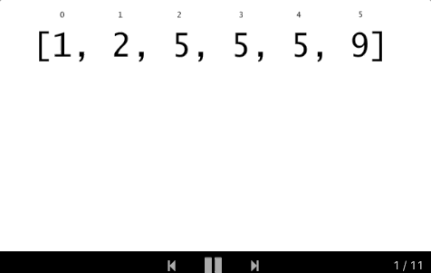

### 34. Find First and Last Position of Element in Sorted Array

https://leetcode.com/problems/find-first-and-last-position-of-element-in-sorted-array/

Given an array of integers nums sorted in ascending order, find the starting and ending position of a given target value.

Your algorithm's runtime complexity must be in the order of O(log n).

If the target is not found in the array, return [-1, -1].

Example 1:
```
Input: nums = [5,7,7,8,8,10], target = 8
Output: [3,4]
```
Example 2:
```
Input: nums = [5,7,7,8,8,10], target = 6
Output: [-1,-1]
```

#### Solution

##### Approach 1: Binary Search
##### Intuition

Because the array is sorted, we can use binary search to locate the left and rightmost indices.

##### Algorithm

The overall algorithm works fairly similarly to the linear scan approach, except for the subroutine used to find the left and rightmost indices themselves. Here, we use a modified binary search to search a sorted array, with a few minor adjustments. First, because we are locating the leftmost (or rightmost) index containing target (rather than returning `true` iff we find `target`), the algorithm does not terminate as soon as we find a match. Instead, we continue to search until `lo == hi` and they contain some index at which target can be found.

The other change is the introduction of the `left` parameter, which is a boolean indicating what to do in the event that `target == nums[mid]`; if `left` is `true`, then we "recurse" on the left subarray on ties. Otherwise, we go right. To see why this is correct, consider the situation where we find target at index i. The leftmost target cannot occur at any index greater than i, so we never need to consider the right subarray. The same argument applies to the rightmost index.

The first animation below shows the process for finding the leftmost index, and the second shows the process for finding the index right of the rightmost index.
##### Find left index:


##### Find right index:


##### Complexity Analysis

- Time complexity : \mathcal{O}(\log N)O(logN)

Here we invoke binary search twice. Let's compute time complexity with the help of master theorem T(N) = aT\left(\frac{N}{b}\right) + \Theta(N^d)T(N)=aT( 
b
N
​	
 )+Θ(N 
d
 ). The equation represents dividing the problem up into aa subproblems of size \frac{N}{b} 
b
N
​	
  in \Theta(N^d)Θ(N 
d
 ) time. Here at step there is only one subproblem a = 1, its size is a half of the initial problem b = 2, and all this happens in a constant time d = 0. That means that \log_b{a} = dlog 
b
​	
 a=d and hence we're dealing with case 2 that results in \mathcal{O}(n^{\log_b{a}} \log^{d + 1} N)O(n 
log 
b
​	
 a
 log 
d+1
 N) = \mathcal{O}(\log N)O(logN) time complexity.

- Space complexity : \mathcal{O}(1)O(1)

All work is done in place, so the overall memory usage is constant.
```java
class Solution {
    // returns leftmost (or rightmost) index at which `target` should be
    // inserted in sorted array `nums` via binary search.
    private int extremeInsertionIndex(int[] nums, int target, boolean left) {
        int lo = 0;
        int hi = nums.length;

        while (lo < hi) {
            int mid = (lo + hi) / 2;
            if (nums[mid] > target || (left && target == nums[mid])) {
                hi = mid;
            } else {
                lo = mid+1;
            }
        }

        return lo;
    }

    public int[] searchRange(int[] nums, int target) {
        int[] targetRange = {-1, -1};

        int leftIdx = extremeInsertionIndex(nums, target, true);

        // assert that `leftIdx` is within the array bounds and that `target`
        // is actually in `nums`.
        if (leftIdx == nums.length || nums[leftIdx] != target) {
            return targetRange;
        }

        targetRange[0] = leftIdx;
        targetRange[1] = extremeInsertionIndex(nums, target, false) - 1;

        return targetRange;
    }
}
```