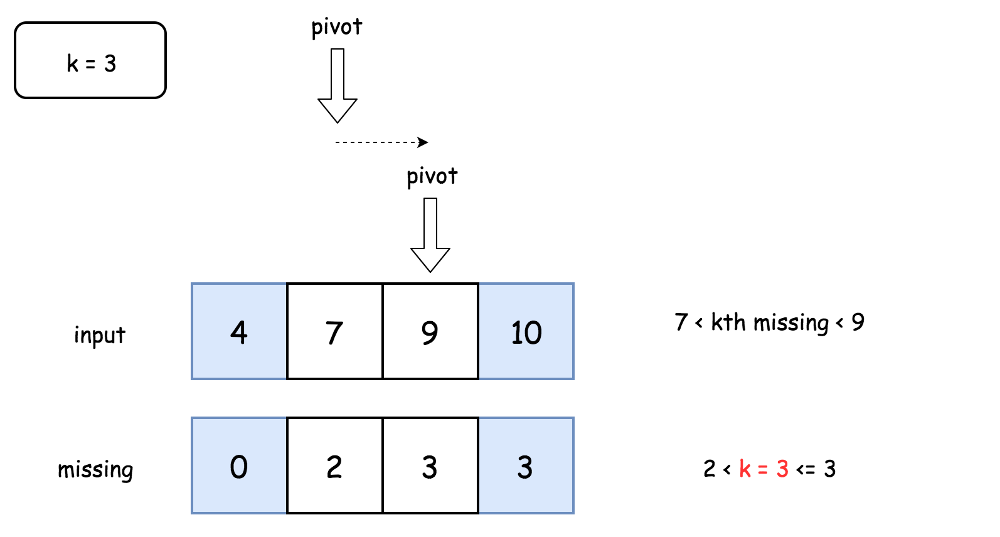

### 1060. Missing Element in Sorted Array

https://leetcode.com/problems/missing-element-in-sorted-array/

Given a sorted array A of unique numbers, find the K-th missing number starting from the leftmost number of the array.

 

Example 1:
```
Input: A = [4,7,9,10], K = 1
Output: 5
Explanation: 
The first missing number is 5.
```
Example 2:
```
Input: A = [4,7,9,10], K = 3
Output: 8
Explanation: 
The missing numbers are [5,6,8,...], hence the third missing number is 8.
```
Example 3:
```
Input: A = [1,2,4], K = 3
Output: 6
Explanation: 
The missing numbers are [3,5,6,7,...], hence the third missing number is 6.
``` 

Note:

1. 1 <= A.length <= 50000
2. 1 <= A[i] <= 1e7
3. 1 <= K <= 1e8

Solution

Approach 1: One Pass

The problem is similar to First Missing Positive and the naive idea would be to solve it in a similar way by one pass approach.

Let's first assume that one has a function `missing(idx)` that returns how many numbers are missing until the element at index `idx`.


With the help of such a function the solution is straightforward :

- Find an index such that `missing(idx - 1) < k <= missing(idx)`. In other words, that means that kth missing number is in-between `nums[idx - 1]` and `nums[idx]`.
  One even could compute a difference between kth missing number and `nums[idx - 1]`. First, there are `missing(idx - 1)` missing numbers until `nums[idx - 1]`. Second, all `k - missing(idx - 1)` missing numbers from `nums[idx - 1]` to kth missing are consecutive ones, because all of them are less than `nums[idx]` and hence there is nothing to separate them. Together that means that kth smallest is larger than `nums[idx - 1]` by `k - missing(idx - 1)`.

- Return kth smallest `nums[idx - 1] + k - missing(idx - 1)`.


The last thing to discuss is how to implement `missing(idx)` function.


Let's consider an array element at index `idx`. If there is no numbers missing, the element should be equal to `nums[idx] = nums[0] + idx`. If k numbers are missing, the element should be equal to `nums[idx] = nums[0] + idx + k`. Hence the number of missing elements is equal to `nums[idx] - nums[0] - idx`.


Algorithm

- Implement `missing(idx)` function that returns how many numbers are missing until array element with index `idx`. Function returns `nums[idx] - nums[0] - idx`.

- Find an index such that `missing(idx - 1) < k <= missing(idx)` by a linear search.

- Return kth smallest `nums[idx - 1] + k - missing(idx - 1)`.

##### Complexity Analysis

Time complexity: O(N) since in the worst case it's one pass along the array.

Space complexity: O(1) since it's a constant space solution.


```java
class Solution {
  // Return how many numbers are missing until nums[idx]
  int missing(int idx, int[] nums) {
    return nums[idx] - nums[0] - idx;
  }

  public int missingElement(int[] nums, int k) {
    int n = nums.length;
    // If kth missing number is larger than 
    // the last element of the array
    if (k > missing(n - 1, nums))
      return nums[n - 1] + k - missing(n - 1, nums);

    int idx = 1;
    // find idx such that 
    // missing(idx - 1) < k <= missing(idx)
    while (missing(idx, nums) < k) idx++;

    // kth missing number is greater than nums[idx - 1]
    // and less than nums[idx]
    return nums[idx - 1] + k - missing(idx - 1, nums);
  }
}

```

Approach 2: Binary Search

Approach 1 uses the linear search and doesn't profit from the fact that array is sorted. One could replace the linear search by a binary one and reduce the time complexity from O(N) down to O(logN).

`The idea is to find the leftmost element such that the number of missing numbers until this element is less or equal to k.`



##### Algorithm

- Implement `missing(idx)` function that returns how many numbers are missing until array element with index `idx`. Function returns `nums[idx] - nums[0] - idx`.

- Find an index such that `missing(idx - 1) < k <= missing(idx)` by a binary search.

- Return kth smallest `nums[idx - 1] + k - missing(idx - 1)`.

```java
class Solution {
  // Return how many numbers are missing until nums[idx]
  int missing(int idx, int[] nums) {
    return nums[idx] - nums[0] - idx;
  }

  public int missingElement(int[] nums, int k) {
    int n = nums.length;
    // If kth missing number is larger than 
    // the last element of the array
    if (k > missing(n - 1, nums))
      return nums[n - 1] + k - missing(n - 1, nums);

    int left = 0, right = n - 1, pivot;
    // find left = right index such that 
    // missing(left - 1) < k <= missing(left)
    while (left < right) {
      pivot = left + (right - left) / 2;

      if (missing(pivot, nums) < k) left = pivot + 1;
      else right = pivot;
    }

    // kth missing number is greater than nums[idx - 1]
    // and less than nums[idx]
    return nums[left - 1] + k - missing(left - 1, nums);
  }
}
```