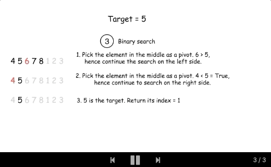

### [33. Search in Rotated Sorted Array](https://leetcode.com/problems/search-in-rotated-sorted-array/)

Suppose an array sorted in ascending order is rotated at some pivot unknown to you beforehand.

(i.e., [0,1,2,4,5,6,7] might become [4,5,6,7,0,1,2]).

You are given a target value to search. If found in the array return its index, otherwise return -1.

You may assume no duplicate exists in the array.

Your algorithm's runtime complexity must be in the order of O(log n).

Example 1:
```
Input: nums = [4,5,6,7,0,1,2], target = 0
Output: 4
```
Example 2:
```
Input: nums = [4,5,6,7,0,1,2], target = 3
Output: -1
```

Solution

##### Approach 1: Binary Search

The problem is to implement a search in **O(logN)** time that gives an idea to use a binary search.

The algorithm is quite straightforward :

- Find a rotation index rotation_index, i.e. index of the smallest element in the array. Binary search works just perfect here.

- rotation_index splits array in two parts. Compare nums[0] and target to identify in which part one has to look for target.

- Perform a binary search in the chosen part of the array.



##### Complexity analysis
- Time complexity: O(logN)
- Space complexity: O(1)

```java
class Solution {
  int [] nums;
  int target;

  public int find_rotate_index(int left, int right) {
    if (nums[left] < nums[right])
      return 0;

    while (left <= right) {
      int pivot = (left + right) / 2;
      if (nums[pivot] > nums[pivot + 1]) {
        return pivot + 1;
      } else {
        if (nums[pivot] < nums[left]) {
          right = pivot - 1;
        } else {
          left = pivot + 1;
        }
      }
    }
    return 0;
  }

  public int search(int left, int right) {
    /*
    Binary search
    */
    while (left <= right) {
      int pivot = (left + right) / 2;
      if (nums[pivot] == target)
        return pivot;
      else {
        if (target < nums[pivot])
          right = pivot - 1;
        else
          left = pivot + 1;
      }
    }
    return -1;
  }

  public int search(int[] nums, int target) {
    this.nums = nums;
    this.target = target;

    int n = nums.length;

    if (n == 0)
      return -1;
    if (n == 1)
      return this.nums[0] == target ? 0 : -1;

    int rotate_index = find_rotate_index(0, n - 1);

    // if target is the smallest element
    if (nums[rotate_index] == target)
      return rotate_index;
    // if array is not rotated, search in the entire array
    if (rotate_index == 0)
      return search(0, n - 1);
    if (target < nums[0])
      // search in the right side
      return search(rotate_index, n - 1);
    // search in the left side
    return search(0, rotate_index);
  }
}
```

##### Approach 2: One-pass Binary Search

Instead of going through the input array in two passes, we could achieve the goal in one pass with an revised binary search.

The idea is that we add some additional condition checks in the normal binary search in order to better narrow down the scope of the search.

##### Algorithm

As in the normal binary search, we keep two pointers (i.e. start and end) to track the search scope. At each iteration, we reduce the search scope into half, by moving either the start or end pointer to the middle (i.e. mid) of the previous search scope.

Here are the detailed breakdowns of the algorithm:

- Initiate the pointer `start` to `0`, and the pointer `end` to `n - 1`.

- Perform standard binary search. While `start <= end`:
    - Take an index in the middle `mid` as a pivot.

    - If `nums[mid] == target`, the job is done, return `mid`.

    - Now there could be two situations:
        - Pivot element is larger than the first element in the array, i.e. the subarray from the first element to the pivot is non-rotated, as shown in the following graph. 
            - If the target is located in the non-rotated subarray: go left: `end = mid - 1`.
            - Otherwise: go right: `start = mid + 1`. 
        - Pivot element is smaller than the first element of the array, i.e. the rotation index is somewhere between 0 and mid. It implies that the sub-array from the pivot element to the last one is non-rotated, as shown in the following graph. 

          - If the target is located in the non-rotated subarray: 
  go right: `start = mid + 1`.
  
          - Otherwise: go left: `end = mid - 1`.
- We're here because the target is not found. Return -1.


```java
class Solution {
  public int search(int[] nums, int target) {
    int start = 0, end = nums.length - 1;
    while (start <= end) {
      int mid = start + (end - start) / 2;
      if (nums[mid] == target) {
        return mid;
      } else if (nums[mid] >= nums[start]) {
        if (target >= nums[start] && target < nums[mid]) {
          end = mid - 1;
        } else {
          start = mid + 1;
        }
      } else {
        if (target <= nums[end] && target > nums[mid]) {
          start = mid + 1;
        } else {
          end = mid - 1;
        }
      }
    }
    return -1;
  }
}
```