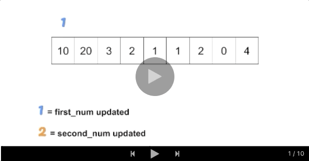

### 334. Increasing Triplet Subsequence

https://leetcode.com/problems/increasing-triplet-subsequence/

Given an unsorted array return whether an increasing subsequence of length 3 exists or not in the array.

Formally the function should:
```
Return true if there exists i, j, k
such that arr[i] < arr[j] < arr[k] given 0 ≤ i < j < k ≤ n-1 else return false.
```
**Note**: Your algorithm should run in O(n) time complexity and O(1) space complexity.

Example 1:
```
Input: [1,2,3,4,5]
Output: true
```
Example 2:
```
Input: [5,4,3,2,1]
Output: false
```

Solution

##### Approach 1: Linear Scan
##### Intuition
The idea is to keep track of the first two numbers in increasing order and find the last number which will be bigger than the first two numbers. Here, the first and second smallest numbers can be updated with conditional checks while scanning nums.



```java
class Solution {
    public boolean increasingTriplet(int[] nums) {
        int first_num = Integer.MAX_VALUE;
        int second_num = Integer.MAX_VALUE;
        for (int n: nums) {
            if (n <= first_num) {
                first_num = n;
            } else if (n <= second_num) {
                second_num = n;
            } else {
                return true;
            }
        }
        return false;
    }
}
```