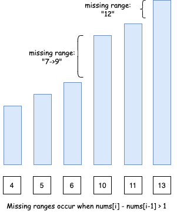
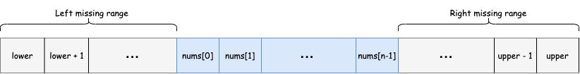

### 163. Missing Ranges

https://leetcode.com/problems/missing-ranges/

You are given an inclusive range `[lower, upper]` and a **sorted unique** integer array `nums`, where all elements are in the inclusive range.

A number `x` is considered **missing** if `x` is in the range `[lower, upper]` and `x` is not in `nums`.

Return the **smallest sorted** list of ranges that **cover every missing number exactly**. That is, no element of nums is in any of the ranges, and each missing number is in one of the ranges.

Each range `[a,b]` in the list should be output as:

- "a->b" if a != b
- "a" if a == b
 

Example 1:
```
Input: nums = [0,1,3,50,75], lower = 0, upper = 99
Output: ["2","4->49","51->74","76->99"]
Explanation: The ranges are:
[2,2] --> "2"
[4,49] --> "4->49"
[51,74] --> "51->74"
[76,99] --> "76->99"
```
Example 2:
```
Input: nums = [], lower = 1, upper = 1
Output: ["1"]
Explanation: The only missing range is [1,1], which becomes "1".
```
Example 3:
```
Input: nums = [], lower = -3, upper = -1
Output: ["-3->-1"]
Explanation: The only missing range is [-3,-1], which becomes "-3->-1".
```
Example 4:
```
Input: nums = [-1], lower = -1, upper = -1
Output: []
Explanation: There are no missing ranges since there are no missing numbers.
```
Example 5:
```
Input: nums = [-1], lower = -2, upper = -1
Output: ["-2"]
``` 

Constraints:

- -10^9 <= lower <= upper <= 10^9
- 0 <= nums.length <= 100
- lower <= nums[i] <= upper
- All the values of nums are unique.

Solution

##### Approach 1: Linear Scan

##### Algorithm

Since the input array, `nums`, is sorted ascendingly and all the elements in it are within the given `[lower, upper]` bounds, we can simply check consecutive elements to see if they differ by one or not. If they don't, then we have found a missing range.

- When `nums[i] - nums[i-1] == 1`, we know that there are no missing elements between nums[i-1] and nums[i].
- When `nums[i] - nums[i-1] > 1`, we know that `[nums[i-1] + 1, nums[i] - 1]` range of elements are missing.



However, there are two edge cases:

- Case 1: If we don't start with `lower` as the first element of the array, we will need to consider `[lower, num[0] - 1]` missing range as well.

- Case 2: Similarly, if we don't end with `upper` as the last element of the array, we will need to consider `[nums[n-1] + 1, upper]` missing range as well. Note n here is the length of the input array `nums`.

##### Complexity Analysis

- Time complexity : $O(N)$, where $N$ is the length of the input array. This is because we are only iterating over the array once.

- Space complexity : $O(N)$, where $N$ is the length of the input array. This is because we could have a missing range between each of the consecutive element of the input array. Hence, our output list that we need to return will be of size $N$.

```java
class Solution {
    public List<String> findMissingRanges(int[] nums, int lower, int upper) {
        int n = nums.length;

        if (n == 0) {
            return Collections.singletonList(formatRange(lower, upper));
        }

        List<String> missingRanges = new ArrayList<>();

        // Edge case 1) Missing ranges at the beginning
        if (nums[0] > lower) {
            missingRanges.add(formatRange(lower, nums[0] - 1));
        }

        // Missing ranges between array elements
        for (int i = 1; i < n; ++i) {
            if (nums[i] - nums[i - 1] > 1) {
                missingRanges.add(formatRange(nums[i - 1] + 1, nums[i] - 1));
            }
        }
        
        // Edge case 2) Missing ranges at the end
        if (nums[n - 1] < upper) {
            missingRanges.add(formatRange(nums[n - 1] + 1, upper));
        }

        return missingRanges;
    }

    // formats range in the requested format
    String formatRange(int lower, int upper) {
        if (lower == upper) {
            return String.valueOf(lower);
        } else {
            return lower + "->" + upper;
        }
    }
}
```