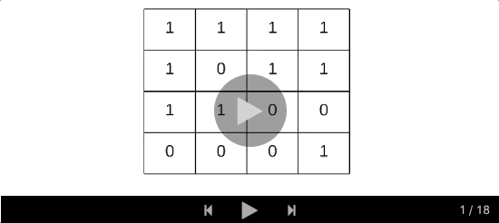

### 73. Set Matrix Zeroes

https://leetcode.com/problems/set-matrix-zeroes/

Given a m x n matrix, if an element is 0, set its entire row and column to 0. Do it in-place.

Example 1:
```
Input: 
[
  [1,1,1],
  [1,0,1],
  [1,1,1]
]
Output: 
[
  [1,0,1],
  [0,0,0],
  [1,0,1]
]
```
Example 2:
```
Input: 
[
  [0,1,2,0],
  [3,4,5,2],
  [1,3,1,5]
]
Output: 
[
  [0,0,0,0],
  [0,4,5,0],
  [0,3,1,0]
]
```
Follow up:

- A straight forward solution using O(mn) space is probably a bad idea.
- A simple improvement uses O(m + n) space, but still not the best solution.
- Could you devise a constant space solution?


### Solution

##### Approach 1:

```java
class Solution {
    public void setZeroes(int[][] matrix) {
        int row = matrix.length;
        int col = matrix[0].length;
        ArrayList<Point> list = new ArrayList<>();
        // find zeros
        for(int i = 0; i < row; i++) {
            for(int j = 0; j < col; j++) {
                if(matrix[i][j] == 0) {
                    list.add(new Point(i, j));
                }
            }
        }
        
        for(Point pt: list) {
            fillZeros(matrix, pt.row, pt.col, row, col);
        }
    }
    
    private void fillZeros(int[][] matrix, int row, int col, int rowMax, int colMax) {
        // horizontal
        for(int j = 0; j < colMax; j++) {
            matrix[row][j] = 0;
        }
        
        // vertical
        for(int i = 0; i < rowMax; i++) {
            matrix[i][col] = 0;
        }
    }
    
    private static class Point {
        int row;
        int col;
        Point(int r, int c) {
            row = r;
            col = c;
        }
    }
}
```
##### Approach 2:
Complexity Analysis:
- Time complexity: O(M x N)
- Space complexity: O(M + N)

```java
class Solution {
  public void setZeroes(int[][] matrix) {
    int R = matrix.length;
    int C = matrix[0].length;
    Set<Integer> rows = new HashSet<Integer>();
    Set<Integer> cols = new HashSet<Integer>();

    // Essentially, we mark the rows and columns that are to be made zero
    for (int i = 0; i < R; i++) {
      for (int j = 0; j < C; j++) {
        if (matrix[i][j] == 0) {
          rows.add(i);
          cols.add(j);
        }
      }
    }

    // Iterate over the array once again and using the rows and cols sets, update the elements.
    for (int i = 0; i < R; i++) {
      for (int j = 0; j < C; j++) {
        if (rows.contains(i) || cols.contains(j)) {
          matrix[i][j] = 0;
        }
      }
    }
  }
}
```

Approach 3: O(1) Space, Efficient Solution
##### Intuition

Rather than using additional variables to keep track of rows and columns to be reset, we use the matrix itself as the indicators.

The idea is that we can use the **first cell** of every row and column as a flag. This flag would determine whether a row or column has been set to zero. This means for every cell instead of going to M+N cells and setting it to zero we just set the flag in two cells.
```
if cell[i][j] == 0 {
    cell[i][0] = 0
    cell[0][j] = 0
}
```
These flags are used later to update the matrix. If the first cell of a row is set to zero this means the row should be marked zero. If the first cell of a column is set to zero this means the column should be marked zero.

##### Algorithm

1. We iterate over the matrix and we mark the first cell of a row i and first cell of a column j, if the condition in the pseudo code above is satisfied. i.e. if `cell[i][j] == 0`.

2. The first cell of row and column for the first row and first column is the same i.e. `cell[0][0]`. Hence, we use an additional variable to tell us if the first column had been marked or not and the `cell[0][0]` would be used to tell the same for the first row.

3. Now, we iterate over the original matrix starting from second row and second column i.e. `matrix[1][1]` onwards. For every cell we check if the row r or column c had been marked earlier by checking the respective first row cell or first column cell. If any of them was marked, we set the value in the cell to 0. Note the first row and first column serve as the `row_set` and `column_set` that we used in the first approach.

4. We then check if `cell[0][0] == 0`, if this is the case, we mark the first row as zero.

5. And finally, we check if the first column was marked, we make all entries in it as zeros.



##### Complexity analysis
- Time complexity: O(M x N)
- Space complexity: O(1)

```java
class Solution {
  public void setZeroes(int[][] matrix) {
    Boolean isCol = false;
    int R = matrix.length;
    int C = matrix[0].length;

    for (int i = 0; i < R; i++) {

      // Since first cell for both first row and first column is the same i.e. matrix[0][0]
      // We can use an additional variable for either the first row/column.
      // For this solution we are using an additional variable for the first column
      // and using matrix[0][0] for the first row.
      if (matrix[i][0] == 0) {
        isCol = true;
      }

      for (int j = 1; j < C; j++) {
        // If an element is zero, we set the first element of the corresponding row and column to 0
        if (matrix[i][j] == 0) {
          matrix[0][j] = 0;
          matrix[i][0] = 0;
        }
      }
    }

    // Iterate over the array once again and using the first row and first column, update the elements.
    for (int i = 1; i < R; i++) {
      for (int j = 1; j < C; j++) {
        if (matrix[i][0] == 0 || matrix[0][j] == 0) {
          matrix[i][j] = 0;
        }
      }
    }

    // See if the first row needs to be set to zero as well
    if (matrix[0][0] == 0) {
      for (int j = 0; j < C; j++) {
        matrix[0][j] = 0;
      }
    }

    // See if the first column needs to be set to zero as well
    if (isCol) {
      for (int i = 0; i < R; i++) {
        matrix[i][0] = 0;
      }
    }
  }
}
```