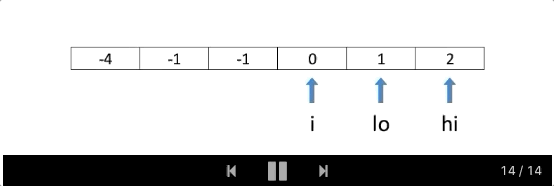

### 15. 3Sum
https://leetcode.com/problems/3sum/

Given an array `nums` of n integers, are there elements a, b, c in `nums` such that a + b + c = 0? Find all unique triplets in the array which gives the sum of zero.

Notice that the solution set must not contain duplicate triplets.

 

Example 1:
```
Input: nums = [-1,0,1,2,-1,-4]
Output: [[-1,-1,2],[-1,0,1]]
```
Example 2:
```
Input: nums = []
Output: []
```
Example 3:
```
Input: nums = [0]
Output: []
``` 

**Constraints:**

- 0 <= nums.length <= 3000
- -10^5 <= nums[i] <= 10^5

Solution

##### Intuition
This problem is a follow-up of Two Sum, and it is a good idea to first take a look at Two Sum and Two Sum II. An interviewer may ask to solve Two Sum first, and then throw 3Sum at you. Pay attention to subtle differences in problem description and try to re-use existing solutions!

[Two Sum](./../two_sum.md), Two Sum II and 3Sum share a similarity that the sum of elements must match the target exactly. A difference is that, instead of exactly one answer, we need to find all unique triplets that sum to zero.

Before jumping in, let's check the existing solutions and determine the best conceivable runtime (BCR) for 3Sum:

1. [Two Sum](./../two_sum.md) uses a hashmap to find complement values, and therefore achieves O(N) time complexity.

2. [Two Sum II](./../binary_search/two_sum_ii.md) uses the two pointers pattern and also has O(N) time complexity for a sorted array. We can use this approach for any array if we sort it first, which bumps the time complexity to O(nlogn).

Considering that there is one more dimension in 3Sum, it sounds reasonable to shoot for O(n^2) time complexity as our BCR.

##### Approach 1: Two Pointers

We will follow the same two pointers pattern as in Two Sum II. It requires the array to be sorted, so we'll do that first. As our BCR is O(n^2), sorting the array would not change the overall time complexity.

To make sure the result contains unique triplets, we need to skip duplicate values. It is easy to do because repeating values are next to each other in a sorted array.

( If you are wondering how to solve this problem without sorting the array, go over the "No-Sort" approach below. There are cases when that approach is preferable, and your interviewer may probe your knowledge there.)

After sorting the array, we move our pivot element `nums[i]` and analyze elements to its right. We find all pairs whose sum is equal `-nums[i]` using the two pointers pattern, so that the `sum of the pivot element (nums[i]) and the pair (-nums[i]) is equal to zero.`

As a quick refresher, the pointers are initially set to the first and the last element respectively. We compare the sum of these two elements to the target. If it is smaller, we increment the lower pointer lo. Otherwise, we decrement the higher pointer hi. Thus, the sum always moves toward the target, and we "prune" pairs that would move it further away. Again, this works only if the array is sorted. Head to the Two Sum II solution for the detailed explanation.




##### Algorithm

The implementation is straightforward - we just need to modify `twoSumII` to produce triplets and skip repeating values.

1. For the main function:

   - Sort the input array nums.
   - Iterate through the array:
      - If the current value is greater than zero, break from the loop. Remaining values cannot sum to zero.
      - If the current value is the same as the one before, skip it.
      - Otherwise, call twoSumII for the current position i.
2. For twoSumII function:

   - Set the low pointer lo to i + 1, and high pointer hi to the last index.
   - While low pointer is smaller than high:
      - If `sum` of `nums[i] + nums[lo] + nums[hi]` is less than zero, increment `lo`.
      - If `sum` is greater than zero, decrement `hi`.
      - Otherwise, we found a triplet:
         - Add it to the result `res`.
         - Decrement `hi` and increment lo.
         - Increment `lo` while the next value is the same as before to avoid duplicates in the result.
3. Return the result res.

##### Complexity analysis
- Time complexity: O(n^2)
- Space complexity: O(n)

```java
class Solution {
    public List<List<Integer>> threeSum(int[] nums) {
        Arrays.sort(nums);
        List<List<Integer>> res = new ArrayList<>();
        for (int i = 0; i < nums.length && nums[i] <= 0; ++i)
            if (i == 0 || nums[i - 1] != nums[i]) {
                twoSumII(nums, i, res);
            }
        return res;
    }
    void twoSumII(int[] nums, int i, List<List<Integer>> res) {
        int lo = i + 1, hi = nums.length - 1;
        while (lo < hi) {
            int sum = nums[i] + nums[lo] + nums[hi];
            if (sum < 0) {
                ++lo;
            } else if (sum > 0) {
                --hi;
            } else {
                res.add(Arrays.asList(nums[i], nums[lo++], nums[hi--]));
                while (lo < hi && nums[lo] == nums[lo - 1])
                    ++lo;
            }
        }
    }
}
```

##### Approach 2: HashSet

Since triplets must sum up to the target value, we can try the hash table approach from the Two Sum solution. This approach won't work, however, if the sum is not necessarily equal to the target, like in 3Sum Smaller and 3Sum Closest.

We move our pivot element nums[i] and analyze elements to its right. We find all pairs whose sum is equal -nums[i] using the Two Sum: One-pass Hash Table approach, so that the sum of the pivot element (nums[i]) and the pair (-nums[i]) is equal to zero.

To do that, we process each element nums[j] to the right of the pivot, and check whether a complement -nums[i] - nums[j] is already in the hashset. If it is, we found a triplet. Then, we add nums[j] to the hashset, so it can be used as a complement from that point on.

Like in the approach above, we will also sort the array so we can skip repeated values. We provide a different way to avoid duplicates in the "No-Sort" approach below.

##### Complexity analysis
- Time complexity: O(n^2)
- Space complexity: O(n)

```java
class Solution {
    public List<List<Integer>> threeSum(int[] nums) {
        Arrays.sort(nums);
        List<List<Integer>> res = new ArrayList<>();
        for (int i = 0; i < nums.length && nums[i] <= 0; ++i)
            if (i == 0 || nums[i - 1] != nums[i]) {
                twoSum(nums, i, res);
            }
        return res;
    }
    void twoSum(int[] nums, int i, List<List<Integer>> res) {
        var seen = new HashSet<Integer>();
        for (int j = i + 1; j < nums.length; ++j) {
            int complement = -nums[i] - nums[j];
            if (seen.contains(complement)) {
                res.add(Arrays.asList(nums[i], nums[j], complement));
                while (j + 1 < nums.length && nums[j] == nums[j + 1]) {
                    ++j;
                }
            }
            seen.add(nums[j]);
        }
    }
}
```

##### Approach 3: "No-Sort"
What if you cannot modify the input array, and you want to avoid copying it due to memory constraints?

We can adapt the hashset approach above to work for an unsorted array. We can put a combination of three values into a hashset to avoid duplicates. Values in a combination should be ordered (e.g. ascending). Otherwise, we can have results with the same values in the different positions.

##### Complexity analysis
- Time complexity: O(n^2)
- Space complexity: O(n)

```java
class Solution {
    public List<List<Integer>> threeSum(int[] nums) {
        Set<List<Integer>> res = new HashSet<>();
        Set<Integer> dups = new HashSet<>();
        Map<Integer, Integer> seen = new HashMap<>();
        for (int i = 0; i < nums.length; ++i)
            if (dups.add(nums[i])) {
                for (int j = i + 1; j < nums.length; ++j) {
                    int complement = -nums[i] - nums[j];
                    if (seen.containsKey(complement) && seen.get(complement) == i) {
                        List<Integer> triplet = Arrays.asList(nums[i], nums[j], complement);
                        Collections.sort(triplet);
                        res.add(triplet);
                    }
                    seen.put(nums[j], i);
                }
            }
        return new ArrayList(res);
    }
}
```