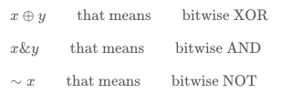
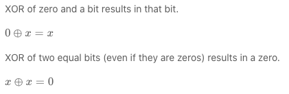
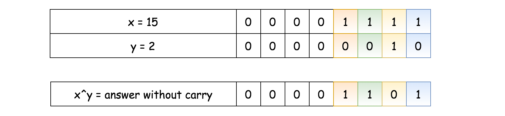
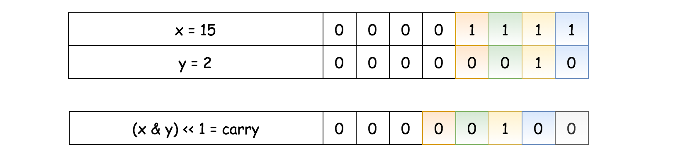
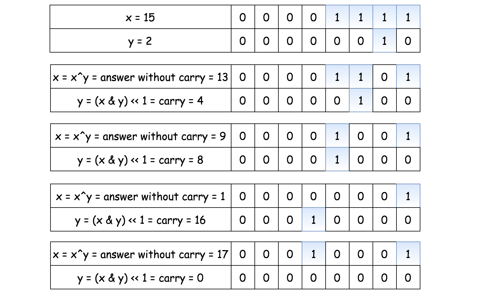
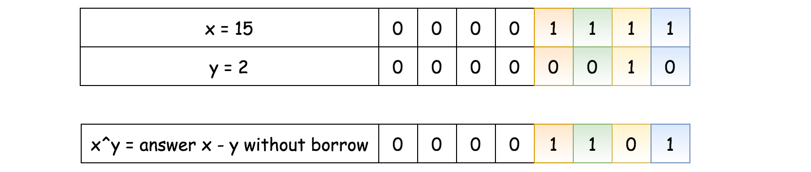
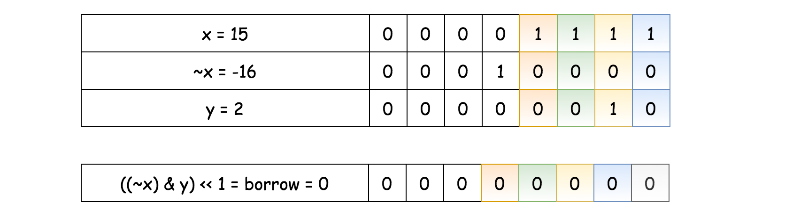

### 371. Sum of Two Integers
https://leetcode.com/problems/sum-of-two-integers/

Calculate the sum of two integers a and b, but you are not allowed to use the operator + and -.

Example 1:
```
Input: a = 1, b = 2
Output: 3
```
Example 2:
```
Input: a = -2, b = 3
Output: 1
```
Solution

Approach 1: Bit Manipulation: Easy and Language-Independent
That's an extremely popular Facebook problem designed to check your knowledge of [bitwise operators](https://wiki.python.org/moin/BitwiseOperators):



##### Reduce the Number of Use Cases

First of all, there are too many use cases here: both a and b could be positive or negative, abs(a) could be greater or less than abs(b). In total, that results in 2 × 2 × 2 = 8 use cases.

Let's start by reducing the problem down to two simple cases:

- Sum of two positive integers: x + y, where x > y.

- Difference of two positive integers: x - y, where x > y.

```java
class Solution {
    public int getSum(int a, int b) {
        int x = Math.abs(a), y = Math.abs(b);
        // ensure that abs(a) >= abs(b)
        if (x < y) return getSum(b, a);
        
        // abs(a) >= abs(b) --> 
        // a determines the sign
        int sign = a > 0 ? 1 : -1;
        
        if (a * b >= 0) {
            // sum of two positive integers x + y
            // where x > y
            
            // TODO  
            }    
        } else {
            // difference of two positive integers x - y
            // where x > y
            
            // TODO  
            }    
        }
        
        return x * sign;
    }
}
```

##### Interview Tip for Bit Manipulation Problems: Use XOR

How to start? There is an interview tip for bit manipulation problems: if you don't know how to start, start from computing XOR for your input data. Strangely, that helps out for quite a lot of problems, [Single Number II](https://leetcode.com/articles/single-number-ii/), [Single Number III](https://leetcode.com/articles/single-number-iii/), [Maximum XOR of Two Numbers in an Array](https://leetcode.com/articles/maximum-xor-of-two-numbers-in-an-array/), [Repeated DNA Sequences](https://leetcode.com/articles/repeated-dna-sequences/), [Maximum Product of Word Lengths](https://leetcode.com/articles/maximum-product-of-word-lengths/), etc.

~~~
What is XOR?
~~~



##### Sum of Two Positive Integers

Now let's use this tip for the first use case: the sum of two positive integers. Here XOR is a key as well because it's a sum of two integers in the binary form without taking carry into account. In other words, XOR is a sum of bits of x and y where at least one of the bits is not set.



The next step is to find the carry. It contains the common set bits of x and y, shifted one bit to the left. I.e. it's logical AND of two input numbers, shifted one bit to the left: carry=(x & y)<< 1.



The problem is reduced down to find the sum of the answer without carry and the carry.

Technically, it's the same problem: to sum two numbers, and hence one could solve it in a loop with the condition statement "while carry is not equal to zero".



##### Difference of Two Positive Integers

As for addition, XOR is a difference of two integers without taking borrow into account.



The next step is to find the borrow. It contains common set bits of yy and unset bits of xx, i.e. borrow=((∼x) & y) << 1.



The problem is reduced down to the subtraction of the borrow from the answer without borrow. As for the sum, it could be solved recursively or in a loop with the condition statement "while borrow is not equal to zero".


##### Algorithm

- Simplify problem down to two cases: sum or subtraction of two positive integers: x±y, where x > y. Save down the sign of the result.

- If one has to compute the sum:

    - While carry is nonzero: y != 0:

        - Current answer without carry is XOR of x and y: answer = x^y.

        - Current carry is left-shifted AND of x and y: carry = (x & y) << 1.

        - Job is done, prepare the next loop: x = answer, y = carry.

    - Return x * sign.

- If one has to compute the difference:

    - While borrow is nonzero: y != 0:

      - Current answer without borrow is XOR of x and y: answer = x^y.

      - Current borrow is left-shifted AND of NOT x and y: borrow = ((~x) & y) << 1.

      - Job is done, prepare the next loop: x = answer, y = borrow.

    - Return x * sign.

```java
class Solution {
    public int getSum(int a, int b) {
        int x = Math.abs(a), y = Math.abs(b);
        // ensure that abs(a) >= abs(b)
        if (x < y) return getSum(b, a);
        
        // abs(a) >= abs(b) --> 
        // a determines the sign
        int sign = a > 0 ? 1 : -1;
        
        if (a * b >= 0) {
            // sum of two positive integers x + y
            // where x > y
            while (y != 0) {
                int answer = x ^ y;
                int carry = (x & y) << 1;
                x = answer;
                y = carry;    
            }    
        } else {
            // difference of two positive integers x - y
            // where x > y
            while (y != 0) {
                int answer = x ^ y;
                int borrow = ((~x) & y) << 1;
                x = answer;
                y = borrow;    
            }    
        }
        return x * sign;
    }
}
```

Optimized with language

```java
class Solution {
    public int getSum(int a, int b) {
        while (b != 0) {
            int answer = a ^ b;
            int carry = (a & b) << 1;
            a = answer;
            b = carry;
        }
        
        return a;
    }
}
```