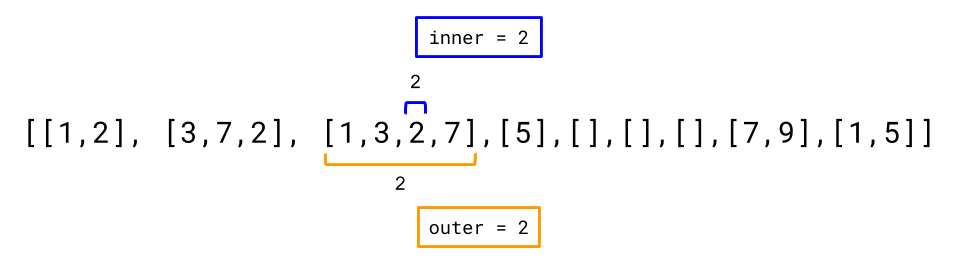

### 251. Flatten 2D Vector

https://leetcode.com/problems/flatten-2d-vector/

Design and implement an iterator to flatten a 2d vector. It should support the following operations: `next` and `hasNext`.

 

Example:
```
Vector2D iterator = new Vector2D([[1,2],[3],[4]]);

iterator.next(); // return 1
iterator.next(); // return 2
iterator.next(); // return 3
iterator.hasNext(); // return true
iterator.hasNext(); // return true
iterator.next(); // return 4
iterator.hasNext(); // return false
``` 

Notes:

1. Please remember to **RESET** your class variables declared in Vector2D, as static/class variables are **persisted across multiple test cases**. Please see here for more details.
2. You may assume that `next()` call will always be valid, that is, there will be at least a next element in the 2d vector when `next()` is called.
 

Follow up:

- As an added challenge, try to code it using only iterators in C++ or iterators in Java.

##### Solution

##### Bad approach: Flatten List in Constructor
##### Why is it bad?
One of the main purposes of an Iterator is to minimize the use of auxiliary space. We should try to utilize the existing data structure as much as possible, only adding as much extra space as needed to keep track of the next value. In some situations, the data structure we want to iterate over is too large to even fit in memory anyway (think of file systems).

In the case of our above implementation, we might as well have just had a single function List<Integer> getFlattenedVector(int[][] v), which would return a List of integers, that could then be iterated over using the List types own standard Iterator.

As a general rule, you should be very cautious of implementing Iterators with a high time complexity in the constructor, with a very low time complexity in the next() and hasNext() methods. If the code using the Iterator only wanted to access the first couple of elements in the iterated collection, then a lot of time (and probably space) has been wasted!

As a side note, modifying the input collection in any way is bad design too. Iterators are only allowed to look at, not change, the collection they've been asked to iterate over.

##### Complexity analysis
- Time complexity:
  - Constructor: $O(N + V)$. In total, we'll append $N$ integers to the nums list. Each of these appends is an $O(1)$ operation. This gives us $O(N)$.
  <br/>
  Something to be cautious of is that inner vectors don't have to contain integers. Think of a test cases such as $[[], [2], [], [], []]$. For this test case, $N=1$, because there's only one integer within it. However, the algorithm has to loop through all of the empty vectors. The cost of checking all the vectors is $O(V)$.
  <br/>
  Therefore, we get a final time complexity of $O(N + V)$.

  - next(): $O(1)$.
    All operations in this method, including getting the integer at a specific index of a list, are $O(1)$.

  - hasNext(): $O(1)$.
    All operations in this method are $O(1)$.
- Space complexity: $O(N)$

```java
import java.util.NoSuchElementException;

class Vector2D {
    
    // Constructor will put all the nums into this list.
    private List<Integer> nums = new ArrayList<>();
    // Keep track of where the Iterator is up to.
    private int position = 0;
    
    public Vector2D(int[][] v) {
        // We need to iterate over the 2D vector, getting all the integers
        // out of it and putting them into nums (a field).
        for (int[] innerVector : v) {
            for (int num : innerVector) {
                nums.add(num);
            }
        }
    }
    
    public int next() {
        // In Java, we throw a NoSuchElementException when next() is called
        // on an exhausted Iterator.
        if (!hasNext()) throw new NoSuchElementException();
        // Store the number we need to return, as we still need to move position forward.
        int result = nums.get(position);
        // Move the position pointer forward by 1, so that it's ready for
        // the next call to next, and gives a correct hasNext result.
        position++;
        return result;
    }
    
    public boolean hasNext() {
        // There's nums left as long as position is a valid index of the list. 
        return position < nums.size();
    }
}
```

##### Approach 1: Two Pointers
Like we said above, Approach 1 is bad because it creates a new data structure instead of simply iterating over the given one. Instead, we should find a way to step through the integers one-by-one, keeping track of where we currently are in the 2D vector. The location of each number is represented with 2 indexes; the index of the inner vector, and the index of the integer within its inner vector. Here's an example 2D vector, with the indexes marked on it.

##### Complexity analysis
- Time complexity:
    - Constructor: $O(1)$. We're only storing a reference to the input vector—an O(1)O(1) operation.

    - advanceToNext(): $O(\dfrac{V}{N})$. If the iterator is completely exhausted, then all calls to `advanceToNext()` will have performed $O(N + V)$ total operations. (Like in Approach 1, the $V$ comes from the fact that we go through all $V$ inner vectors, and the $N$ comes from the fact we perform one increment for each integer). 
    <br/>However, because we perform $N$ `advanceToNext()` operations in order to exhaust the iterator, the amortized cost of this operation is just $\dfrac{O(N + V)}{N} = O(\dfrac{N}{N} + \dfrac{V}{N}) = O(\dfrac{V}{N}$).
    
    - next() / hasNext(): $O(\dfrac{V}{N})$ or $O(1)$. The cost of both these methods depends on how they are called. If we just got a value from next(), then the next call to either method will involve calling advanceToNext(). In this case the time complexity is $O(\dfrac{V}{N})$.
      <br/>However if we call hasNext(), then all successive calls to hasNext(), or the next call to next(), will be $O(1)$. This is because advanceToNext() will only perform an $O(1)$ check and immediately return.
- Space complexity: $O(1)$

```java
import java.util.NoSuchElementException;

class Vector2D {
    
    private int[][] vector;
    private int inner = 0;
    private int outer = 0;
    
    public Vector2D(int[][] v) {
        // We need to store a *reference* to the input vector. 
        vector = v;
    }

    // If the current outer and inner point to an integer, this method does nothing.
    // Otherwise, inner and outer are advanced until they point to an integer.
    // If there are no more integers, then outer will be equal to vector.length
    // when this method terminates.
    private void advanceToNext() {
        // While outer is still within the vector, but inner is over the 
        // end of the inner list pointed to by outer, we want to move
        // forward to the start of the next inner vector.
        while (outer < vector.length && inner == vector[outer].length) {
            inner = 0;
            outer++;
        }
    }
    
    public int next() {
        // As per Java specs, throw an exception if there's no next.
        // This will also ensure the pointers point to an integer otherwise.
        if (!hasNext()) throw new NoSuchElementException();
        // Return current element and move inner so that is after the current
        // element.
        return vector[outer][inner++];
    }
    
    public boolean hasNext() {
        // Ensure the position pointers are moved such they point to an integer,
        // or put outer = vector.length.
        advanceToNext();
        // If outer = vector.length then there are no integers left, otherwise
        // we've stopped at an integer and so there's an integer left.
        return outer < vector.length;
    }
}
```