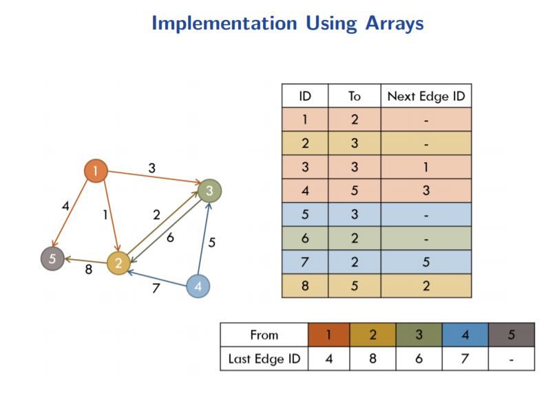

From:
https://web.stanford.edu/class/cs97si/06-basic-graph-algorithms.pdf

Graphs - Outline
===
1. <a class="nav-link" href="#graphs">Graphs</a>
2. <a class="nav-link" href="#adj_graphs">Adjacency Matrix and Adjacency List</a>
3. <a class="nav-link" href="special_graphs">Special Graphs</a>
4. <a class="nav-link" href="#dfs_bfs">Depth-First and Breadth-First Search</a> 
5. <a class="nav-link" href="#topological_sort">Topological Sort</a>
6. <a class="nav-link" href="#eulerian_circuit">Eulerian Circuit</a>
7. <a class="nav-link" href="#mst">Minimum Spanning Tree(MST)</a>
8. <a class="nav-link" href="#scc">Strongly Connected Components(SCC)</a>

<h4 id="graphs">Graphs</h4>

   - An abstract way of representing connectivity using nodes (also
called vertices) and edges
   - We will label the nodes from 1 to n
   - m edges connect some pairs of nodes &rarr; Edges can be either one-directional (directed) or bidirectional
   - Nodes and edges can have some auxiliary information
  ![](data:image/png;base64,iVBORw0KGgoAAAANSUhEUgAAAVYAAACTCAMAAADiI8ECAAABsFBMVEX///8AmQAAAAAAmwD5+fkAmADT09OioqIAlgCoqKjY2Nh1dXVqamrFxcXBwcEAnQAWFhYAkgDg4ODw8PDq6uqBgYGOjo4AgABcXFwAjQCHh4eurq5iYmIAhQD/9Kd7e3vMzMyUlJQAdAAAZABMTExnZ2c/Pz8ApFAAeQAAPgAAEQAAQwAATQB51NgAJwAALQAjIyMsLCwaGhoAbAAAGAAANQAAFgD//98AXAAvmACQtxVGRkb//9wAHQAASQAAOwDh7uAAoD+Tx5O8w0X//+0BAAHr/v+v7/5UoABfsV////YAXgDD+P8rKyugzaCB6fCewFEfwrkArHfX9fyw1bAAnStzyqTE38Kx0IJYxqHA0nu48erk8cgwrV6d3shY1tLz7q7b3YlqxpF8tCzV1FD/98XExBwwt6F509gApmbW+PEvt5Dl+N3I4KBhqTtHrFKfyWna44WrwTCAx3Kh6eVyqww1tEI3tVR30MPM2Gv17ZCR4/Hl7avm325iuXOa3qRrv5C79OKIt0K76seVti7f4K7D2aGOvGegzaiozI9Prxqy4pxZ0dlrszk4un6r28ICsMW8AAAQyElEQVR4nO2diV8T1xbHJyczyWSdzExWEkwCIUBACCBCZDFoWIsUlajUvZZagq11e2JL7eL6fLX9l9+9WSaTDTJzR3SS/D4fhWC4jF/OnDn33HPvoajPJMFpj4+BayxmNokaDSmazP6xcbgQtzsFjYbUmazhcZDkt2gypsVfHnLcZtVkTF2J9qD/+ehwj48NDPQOjgDMRIjHNMUA5gZ7BwKMr2d6Eo0fpskvVFdyhwAGBxiOMyJxXGA6ARAkHNO5CInpQGlIw8AQugncmlytXuROQmKC4YyGoozGwCiAmWhMC8BIwCgNaeCYidOQbCeuYgzmfGWoebDsMJm9OgGG2cohOd8IzGj1MNSBPHDKxxkqZTQOwrj6p7dwAQYNxqoxOV+ijfyrA2CgmiriykxCn1oGtB0m2WqqiOsAgFPTa/+CFYPBWqqIK2JgUjmkFaCn3pjcPMQ1vfYvV05IBCTDYliWZcoMYirH9MOQjCrLSr8qPtEu5uqFYUaimr1y9Vqq+NLYDaByTACf7De1/Y30AwzD0KXp1X+pQmHARMmymIXr32S3b6wwRe96SqVpOeGU5FmZm7eWTkhYuR6ItUWQJbgS3SUE7O07KYb/+m7xpjXOg1fVmFEYkkBmv713sozV2H1qsS2yAwKcKrlWpn/9Oxax3SmZq9o7FvkV2XOKlWMNzEFb5AasMCL5gEuXv0dY78/eK2DgJiAWtChXUOZXqrAauFHV4YWuJMe6h7Eye5m/itY6ASGrSbmsfY2xGtsEqwCnS761ZK1T98idAFMfa9s4AQESpWCI2b2MfevFkm81DKl8ZHllj6wqrL7TrrZ4ZIkh6C3dseztEzgSOChErkYWIKJqTBMAX566sj+ckOYDyF372yPbEoX5kjExu7lNfu9ByQf4CKYD5SwDw588Ic3cmGGVN4DuZHKVp0TszVvpHz+WwtazYFM5pgcmpenAdi6dThfnWWjittgWTywKT+Any6bF8iXLQhMi1Qisi+VUC8sjFX9T3FlwWdokNWiFsnctCz+zParH7IK5QJ3E4ATy1o5QsD3ARqEizixQZUdhTP3DRYzDCF+Txu4BiKJ/tNiD7fDYovsg0VOx6GLk+LNqw4CCkBs4G6gasycB/ryhik4/2UKZTuQHGJZBMDIoCBh3EA0ZTaJwgCkPyQWmoUgVKxhqA4sVwwCjEyzHcUb0h+seAnCRPbG73FYXwKCPK47JTIwC2GQkaUcoSnjVOlAwDgCT0xO+nt75BMCih8yWutC3i12LAIn53h7fRL76Il5dKuPwB1s+9+o2j5Ure8JkDgDZav6DI1wecsxcB6HTZm75qIAWon2h8Vgo7CT1eh6JlegMh2Lj/r6otT4+5ArawMdSVFiDMbxVdnn4XC1os7Q+WBv5TdlVTcl++PuRxba8KyDH6q2xvSOwIgXtltZ+eBFj9dTyORorRUf8LZ3ZIsRKd9X5/iawUjjcqhcrtIgIsdax1WaxIh9rb1mLJcJKe+p+d5NYkSKhFrVYIqxd9Zk0jxVPEKKtGG6RYK1vq8qwoodXyNx6YAmw1kZWRSnCSuEJQsu5AvVYGydnlGKlaFNfi2W31GKlG9qqCqxITntjixUcDqfTEdGTRavFGj7EH6rBiizWX7+kxmyP51NiizN2/VQgq8NKH7qYqAorkslvrq6AEc2Y6Ojk0NDoCPokqZfVRnVYw4fekGqxopmXzVtxPYIf4FSvL8BzxkBgYFo/OxPVYKWPyCaqx4ostk9msQ4XzH2V35aIdzgZjexwAi7owsWqwVqTCawSCVb08ApHi+RMACPd8tVcI96RFNcDVxVYG80CJJFhpSirPT/zEuJ4jbyq9MA3AjEd+AHFWA+LrIoixZq3WIGKwWhtpQznK5R0fOFSjLWJJVpyrBRttdsBuutsoeN6IfnlFyIrxFo3v1otDbBSuERkuraqC1c1Depgq5dCrLZmsiKaYI0snipvdJIVIeLKrnENcjM7P7GB7MOHD1MX8as7qcDCMvmgVLR4IynCSjdX/6oJ1mh5vyf/z6ur6Rs/S1xPa7Lhc+oMv7dEUY/u518dpPrXNRg0CF35+FAR1iZLXzTBGpOqRZn+65ssQvC4VDQ7BFoswyOs95fW0ukcRaXT6R/zWDPpNPpKeokq/K1cNJq/2ARFWI+aBUjSBOuiVDPOLDxJMUz26V1eemip3fIsVx7r1DN06x98YP7zEGNFnzx/zvO7uZ17C0+4vcvSe+mIozlFunD2wiMomAweNQuQpAlW2S4PhmUQ26ePStbaAzMa/ICpM2z24U/sMjW7wu5T59n+5Sn8yQt+YTnzjP+Beszfl95rjbuaVDKfFoq7mr6MI2cBkjTCWhFdMZdyZ8o7ycc0+AEI617uxsd16hGf/RX71uVfeAZ/srB8gme3t84Eyt6Wdjibk8OTL2lr2lqbiqyK0tpaMdXs0xeyUEAba0VOgEIe9LcarL9grFtbV5V7VzoE0KfAtx6WX62Wxr4VU+X3XzDScRIa+laKmr11kEJY7/L9y3dS7ElkuwvLOyn2BxSC3VI+aBA8CiIBUdFmDU2wxmX7RpjsrRc8ky1h1SwS2Ftaow/2Mmf47Qdn+IWnmdf87u/32IXltfP8pfXZZ7eVDxotFl83h7WpWYAkreNWRHWT5wNXintItYlbd1ZfvlzF2qcy11Zf/v5u9WVuDX+SwvOCgyerL58SjN4MVlHhLjhtZlkwV5xlIb+6dvXqgwcPCliRa3V9mhXwtbcopPqF12Je0AzWpiOrojTBKpZzAtk/zmG9S33inMDa40t/vvmQPanBUEdjPXzdqp60SbU4yxkstqCCC5iA5Kfa7zn1dmNjK6fFSEdipb2Ks8baYEXT15E6+dZu0MPm5COxNj8LkKQRViEOg3z16kD3KMzof3VAVOPGNMJKdeXXsmRQjdxAoiXWslStd2uD1eq3OBdhrjd/Imx+5ZVjpxMwrgeqh3MT1YXdWmA12fC0GtcJzBXqBPjAwFdQuTHxC9ahWFXWOpBjddsKc0BKjBaqWubnJ3FVy3gLVLWotFVyrELULisaMoeK2x3jfa1Qg6UkZ1UpMqxitHqrqNURhKjDoQunWlRDrMpnAZJIsIqWUKT2qx5NkivHqEZYRYKYWz1WOmir1wEBTbgW1V/O51AjrCpmAZJUY3XW32fsxs6VcA/5Mas+VlWzAEkqsTbc9NKHH1jqfdLnUH2sZFWkqrAK9miDU/OC+ThAX6fr1sOqOrIqSgVWq6fhqo4p5nGM+f368gL1sKqOrIpSjFUMexrn+twCRSctdFjtiXKfRbVYla1b1ZNCrO5o6IgSQJMriAxa/QUdv2qwisrzq9VShjVqP/L2droiaq/lM6kaK8EsQJICrKIz5Dz612jWR9pKpqqnE1lkVVTzXrB+9F+jqBZVLMcmIWrvS/rtHkfZXkj359AOj92f7GsYLFUoEmruMBzapkUVy/HIbZGdg+WJFL5G6AEiniPOwap4s63ZiEOc0U0UEJzBeczpXl/P9BCuHcwvWpPMWIuntsHQdI+vd3oUJ/IO67/ltnuaPjPb7dLBJgwsGp8x2Fs+Y3AQwGUltNV6Zww2+jVZvXYFDyGB6KzOY1TNiZgDAEkyk4hcwCdicuXVvMCw/ERMuWhvOKJkaBPoIxCw43NxK89aDUySnYlpXYTJOue3hmrf6TaHFP4gC+hiAavuacM86WnDo9Vr+tJpw3LRFpvilodhggs7PjU+G1t90OqFuep9lIZ8JWpl6xHa6VexyDcT0sPCYEh2knulbS2qnXcLrlr7z495tqLCN2hTddqNHnZjVvQdMBT2OxTtdVL1ipEHRo3lDRTlPnwVfQesfSpPuiHu7Hscwl0yZOXjC398LDUe0KZLRvbluXM/lSrSy10yTB6l9ZwlWfXQzlDe0wWJv02dL3XJYNW2zpT1dGH6/7z28tvrj0peoNjTRbQdklE9Qs7FiNpvPT4JroTMB7D3b1w+LzW2UduBKAqDjIT19xTL72WkPjG4A5HbGyJoQxQd00EPI1m/LAzh1eq6hFWbflmcgZFhRfGF4D06o3qYuvRQeSmUu7shY93f7JdhnYCQYFUuoaK7G8OvvvxzU3pojUIsQnbFdr8m//FPK1nTPAO7h3fQnpfvI7OYlctS2Yswe+XVq7+kTVSjpN3dxJge8lfyzpk3X63wCCtf2vU4rUnnTAPL7uVes5ITIMQqJPXQuEQAqc8ru7+zsfF+6c1GqcWj2j6v8qZ5DIujtuXfCtupNejzatLFUrasKzFzc3V19dvLd1c/FJrmMXPkXYmZPWSnZazYrxCmnyL6yF/JHttoQoSdQEBqxUbeQxs3jOTZ7XTRCWjQQzuo9qKOVxUd37NX0lTmTWGexQ0TdHyfl+6A96/SD15tFr01nyCeeXqa35v/WRWTd73Hp8sUpvDGgYTqLLypPHtlZFvTDNw8xEkvd0YP8RWVrxYdqJMYZCahT23cTdthkq09XgmfXUc8n9fB8UwFheG0ryaNbRwCgka3QhLOGqu5cr7TjZezmpYeEi15oWBgxFexQGIwssNA5AXRLTBcZa9c9whxGEBRbl3EV3m5x+F0DyNbIjTykwBkUbcZYJSXGSxn6DkF4+RJEqeOWpu7/QBDA0x+g56R4wJfJchsFQvZa2I6UBrS4JsH8GuQetJF/qokXCgAk9MD3YbAwMTQCEA8QjxmJA4wMtTrCxi6B6YnE8Udf25C1xiO6WF9UJLVNl6u7NGoX6jZXx5y3GbKFwSSlk6E9JBokcsa9LtwnVA8GtHKIMRINI4rhlz+IE6weBFmwoJ5d1wv8dUxyZo33cWIILjdouowy6GXQqHjUlDyBxfisZCtyxs1B4MOk6DszvDqIyNwjHJ7kD+YcTgtUY89FJuJj11IjrvyLuJC3G/3RINOqxtJFOnGthzRwwkixy1HSL6WK7qtEYczGLREu2z+mTGXZMuYsdkSDDoj1bZsSuorDjgm0ZZkneI29HVaFEVkqYIjaEaMY2PIjrHGk2Nj8Rl/X9hrDjqDZrvONrkdn8Rmu4yJblMEkTRHvWF70ZbH/HooZ/lMUh4E0MiQBSR3xwF01FFHHXXUUUcdddRRRx111FHrC/f8wd2AMuhD3TdkVLUEandl3qb47D5Fzb7L3qrkN3Xu3Dr6+zWvor1CR9R37ALuoPDiYtXX76QCXyPsmxh6R4q1s8LeR87gr6fU1NbG+xyy3/cb62/eb11j2e33uTf/xW0r1m5s4H+iKPTx3xzuwIBe/9vxDocos8nu5qgTe0sHK/2v7i08zWwy/POHH3b/l2L3ry7tfOQvUpmfmX+uvuhfp+6m/nmb6l9f+4bZTn+jSRfB1tUJlv97bfPrzDP+b+o3fndpaoXdW5r6dyfF550AwnqX3V2n1t6tz66wv1Lf8/dnV7JXctTby0eP3cZCGC/deJi7wzP9qyt8AMFDfJFzkLDizkAI4Rr1C8/cRG/pz73m2QWinjbtoO945vltZLTs7XyYVcR6p4z1sYSVPZlOP0hTmWtPUizf4Xqobqww/dcp5ARQMLDzB7JeCevUrbWCE0B+derJOnq6naSog/2pc0vUzjO+EyIcqszjAG64dvCB3X/78eTaQSpwH08QnvHbm7d3PgYu5dAj69LVze0l9MhauPXjT8uz9/7591pqV4sOra2sB4X+P1NbW/kAa2trCwdPs/jDG/TiOgqwtjby8RT6iN6LX77f6jyxOuqoo4460rP+D3LWGCaFp9uAAAAAAElFTkSuQmCC)
#### Why Study Graphs?
Lots of problems formulated and solved in terms of graphs
- Shortest path problems
- Network flow problems
- Matching problems
- 2-SAT problem
- Graph coloring problem
- Traveling Salesman Problem (TSP): still unsolved!
- and many more...

<h4 id="adj_graphs">Adjacency Matrix and Adjacency List - Storing Graphs</h4>

- Need to store both the set of nodes V and the set of edges E
    - Nodes can be stored in an array
    - Edges must be stored in some other way
- Want to support operations such as:
    - Retrieving all edges incident to a particular node
    - Testing if given two nodes are directly connected
- Use either adjacency matrix or adjacency list to store the edges

#### Adjacency Matrix
- An easy way to store connectivity information
    - Checking if two nodes are directly connected: O(1) time
- Make an n × n matrix A
    - a<sub>ij</sub> = 1 if there is an edge from i to j
    - a<sub>ij</sub> = 0 otherwise
- Uses Θ(n<sup>2</sup>) memory
    - Only use when n is less than a few thousands,
    - and when the graph is dense

#### Adjacency List
- Each node has a list of outgoing edges from it
    - Easy to iterate over edges incident to a certain node
    - The lists have variable lengths
    - Space usage: Θ(n + m)
    

#### Implementing Adjacency List
- Solution 1. Using linked lists
    - Too much memory/time overhead
    - Using dynamic allocated memory or pointers is bad
- Solution 2. Using an array of vectors
    - Easier to code, no bad memory issues
    - But very slow
- Solution 3. Using arrays (!)
    - Assuming the total number of edges is known
    - Very fast and memory-efficient
#### Implementation Using Arrays


- Have two arrays E of size m and LE of size n
    - E contains the edges
    - LE contains the starting pointers of the edge lists
- Initialize LE[i] = -1 for all i
    - LE[i] = 0 is also fine if the arrays are 1-indexed
- Inserting a new edge from u to v with ID k
```
E[k].to = v
E[k].nextID = LE[u]
LE[u] = k
```
- Iterating over all edges starting at u:
```
for(ID = LE[u]; ID != -1; ID = E[ID].nextID)
// E[ID] is an edge starting from u
```
- Once built, it’s hard to modify the edges
    - The graph better be static!
    - But adding more edges is easy


<h4 id="special_graphs">Special Graphs</h4>

#### Tree
- A connected acyclic graph
    - Most important type of special graphs
    - Many problems are easier to solve on trees

- Alternate equivalent definitions:
    - A connected graph with n − 1 edges
    - An acyclic graph with n − 1 edges
    - There is exactly one path between every pair of nodes
    - An acyclic graph but adding any edge results in a cycle
    - A connected graph but removing any edge disconnects it

#### Other Special Graphs

- Directed Acyclic Graph (DAG): the name says what it is
    - Equivalent to a partial ordering of nodes

- Bipartite Graph: Nodes can be separated into two groups S
and T such that edges exist between S and T only (no edges
within S or within T)

<h4 id="dfs_bfs">Depth-First and Breadth-First Search</h4>

#### Graph Traversal

- The most basic graph algorithm that visits nodes of a graph
in certain order
- Used as a subroutine in many other algorithms
- We will cover two algorithms
    - Depth-First Search (DFS): uses recursion (stack)
    - Breadth-First Search (BFS): uses queue
#### Depth-First Search

DFS(v): visits all the nodes reachable from v in depth-first order
- Mark v as visited
- For each edge v → u:
    - If u is not visited, call DFS(u)
- Use non-recursive version if recursion depth is too big (over a
few thousands)
    -  Replace recursive calls with a stack

#### Breadth-First Search
BFS(v): visits all the nodes reachable from v in breadth-first order
- Initialize a queue Q
- Mark v as visited and push it to Q
- While Q is not empty:
    - Take the front element of Q and call it w
    - For each edge w → u:
- If u is not visited, mark it as visited and push it to Q

<h4 id="topological_sort">Topological Sort</h4>

- Input: a DAG G = (V, E)
- Output: an ordering of nodes such that for each edge u → v,
u comes before v
- There can be many answers
    - e.g., both {6, 1, 3, 2, 7, 4, 5, 8} and {1, 6, 2, 3, 4, 5, 7, 8} are valid orderings for the graph below

  
- Any node without an incoming edge can be the first element
- After deciding the first node, remove outgoing edges from it
- Repeat!
- Time complexity: O(n<sup>2</sup> + m)
    - Too slow...


Java Implementation

```java
// This class represents a directed graph using adjacency 
// list representation 
class Graph {
    private int V; // No. of vertices
    private LinkedList<Integer> adj[]; // Adjacency List

    // Constructor
    Graph(int v) {
        V = v;
        adj = new LinkedList[v];
        for (int i = 0; i < v; ++i) {
            adj[i] = new LinkedList();
        }
    }

    // Function to add an edge into the graph
    void addEdge(int v, int w) {
        adj[v].add(w);
    }

    // A recursive function used by topologicalSort
    void topologicalSortUtil(int v, boolean visited[], Stack stack) {
        // Mark the current node as visited.
        visited[v] = true;
        Integer i;

        // Recur for all the vertices adjacent to this
        // vertex
        Iterator<Integer> it = adj[v].iterator();
        while (it.hasNext()) {
            i = it.next();
            if (!visited[i]) {
                topologicalSortUtil(i, visited, stack);
            }
        }

        // Push current vertex to stack which stores result
        stack.push(v);
    }

    // The function to do Topological Sort. It uses
    // recursive topologicalSortUtil()
    void topologicalSort() {
        Stack stack = new Stack();

        // Mark all the vertices as not visited
        boolean visited[] = new boolean[V];

        // Call the recursive helper function to store
        // Topological Sort starting from all vertices
        // one by one
        for (int i = 0; i < V; i++)
            if (visited[i] == false) {
                topologicalSortUtil(i, visited, stack);
            }

        // Print contents of stack
        while (!stack.isEmpty()) {
            System.out.print(stack.pop() + " ");
        }
    }

    // Driver method
    public static void main(String args[]) {
        // Create a graph given in the above diagram
        Graph g = new Graph(6);
        g.addEdge(5, 2);
        g.addEdge(5, 0);
        g.addEdge(4, 0);
        g.addEdge(4, 1);
        g.addEdge(2, 3);
        g.addEdge(3, 1);

        System.out.println("Following is a Topological " + "sort of the given graph");
        g.topologicalSort();
    }
}
```

#### Topological Sort (faster version)
- Precompute the number of incoming edges deg(v) for each
node v
- Put all nodes v with deg(v) = 0 into a queue Q
- Repeat until Q becomes empty:
    - Take v from Q
    - For each edge v → u:
- Decrement deg(u) (essentially removing the edge v → u)
- If deg(u) = 0, push u to Q
- Time complexity: Θ(n + m)

#### Related Problem
[Course Schedule](./topological_sort/course_schedule.md),

[Course Schedule](./topological_sort/course_schedule_ii.md),

[Alien Dictionary](./topological_sort/alien_dictionary.md)

<h4 id="eulerian_circuit">Eulerian Circuit</h4>

- Given an undirected graph G
- Want to find a sequence of nodes that visits every edge
exactly once and comes back to the starting point
- Eulerian circuits exist if and only if
    - G is connected
    - and each node has an even degree

#### Constructive Proof of Existence
- Pick any node in G and walk randomly without using the
same edge more than once
- Each node is of even degree, so when you enter a node, there
will be an unused edge you exit through
    - Except at the starting point, at which you can get stuck
- When you get stuck, what you have is a cycle
    - Remove the cycle and repeat the process in each connected
component
    - Glue the cycles together to finish!

#### Related Problems
- Eulerian path: exists if and only if the graph is connected and
the number of nodes with odd degree is 0 or 2.
- Hamiltonian path/cycle: a path/cycle that visits every node in
the graph exactly once. Looks similar but very hard (still
unsolved)!

<h4 id="mst">Minimum Spanning Tree ( MST )</h4>

- Given an undirected weighted graph G = (V, E)
- Want to find a subset of E with the minimum total weight
that connects all the nodes into a tree
- We will cover two algorithms:
    - Kruskal’s algorithm
    - Prim’s algorithm

#### Kruskal’s Algorithm

- Main idea: the edge e<sup>*</sup> with the smallest weight has to be in the MST
- Simple proof:
    - Assume not. Take the MST T that doesn’t contain e<sup>⋆</sup>.
- Add e<sup>⋆</sup> to T, which results in a cycle.
    - Remove the edge with the highest weight from the cycle.
- The removed edge cannot be e<sup>⋆</sup> since it has the smallest weight.
    - Now we have a better spanning tree than T
    - Contradiction!
- Another main idea: after an edge is chosen, the two nodes at
the ends can be merged and considered as a single node
(supernode)
- Pseudocode:
    - Sort the edges in increasing order of weight
    - Repeat until there is one supernode left:
        - Take the minimum weight edge e<sup>⋆</sup>
        - If e<sup>⋆</sup> connects two different supernodes, then connect them and merge the supernodes (use union-find)
    - Otherwise, ignore e<sup>⋆</sup> and try the next edge

#### Prim’s Algorithm

- Main idea:
    - Maintain a set S that starts out with a single node s
    - Find the smallest weighted edge e<sup>⋆</sup> = (u, v) that connects u ∈ S and v /∈ S
    - Add e<sup>⋆</sup> to the MST, add v to S
    - Repeat until S = V
- Differs from Kruskal’s in that we grow a single supernode S
instead of growing multiple ones at the same time

#### Prim’s Algorithm Pseudocode

- Initialize S := {s}, Dv := cost(s, v) for every v
    - If there is no edge between s and v, cost(s, v) = ∞
- Repeat until S = V :
    - Find v /∈ S with smallest Dv &rarr; Use a priority queue or a simple linear search
    - Add v to S, add Dv to the total weight of the MST
    - For each edge (v, w): &rarr; Update Dw := min(Dw, cost(v, w))
- Can be modified to compute the actual MST along with the
total weight

#### Kruskal’s vs Prim’s
- Kruskal’s Algorithm
    - Takes O(m log m) time
    - Pretty easy to code
    - Generally slower than Prim’s
- Prim’s Algorithm
    - Time complexity depends on the implementation &rarr; Can be O(n<sup>2</sup> + m), O(m log n), or O(m + n log n)
    - A bit trickier to code
    - Generally faster than Kruskal’s


<h4 id="scc">Strongly Connected Components (SCC)</h4>

- Given a directed graph G = (V, E)
- A graph is strongly connected if all nodes are reachable from
every single node in V
- Strongly connected components of G are maximal strongly
connected subgraphs of G
- The graph below has 3 SCCs: {a, b, e}, {c, d, h}, {f, g}

#### Kosaraju’s Algorithm
- Initialize counter c := 0
- While not all nodes are labeled:
    - Choose an arbitrary unlabeled node v
    - Start DFS from v
        - Check the current node x as visited
        - Recurse on all unvisited neighbors
        - After the DFS calls are finished, increment c and set the label of x as c
- Reverse the direction of all the edges
- For node v with label n, n − 1, . . . , 1:
    - Find all reachable nodes from v and group them as an SCC

- We won’t prove why this works
- Two graph traversals are performed
    - Running time: Θ(n + m)
- Other SCC algorithms exist but this one is particularly easy to
code and asymptotically optimal.