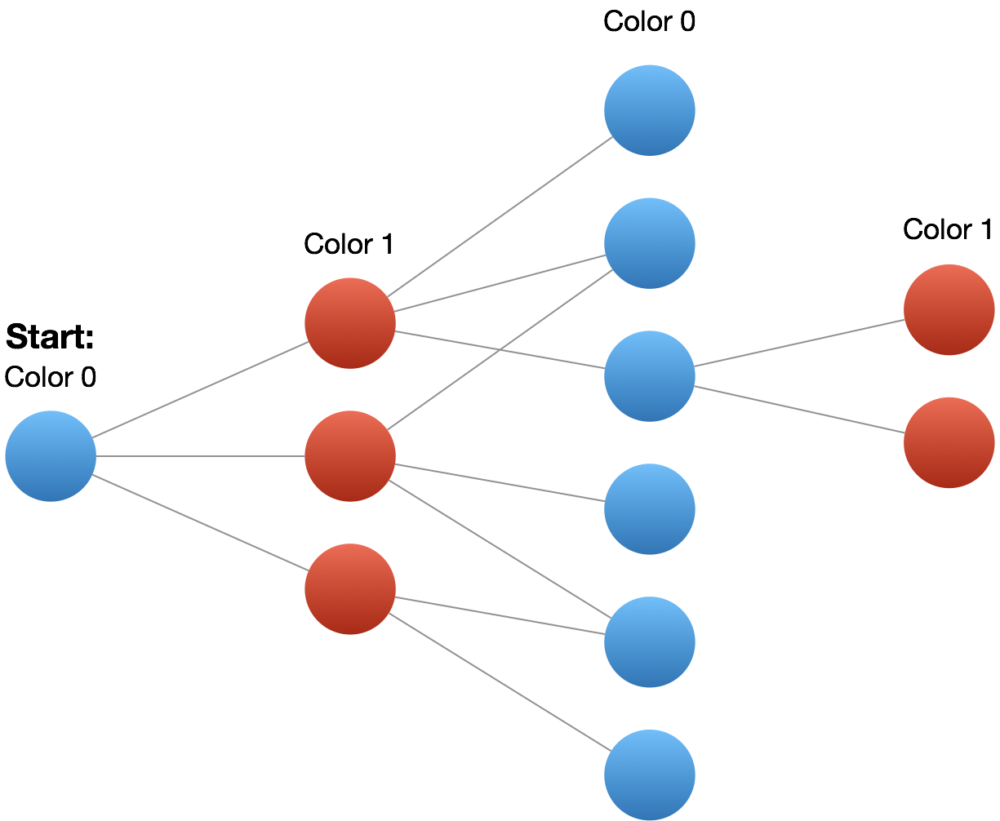

### 785. Is Graph Bipartite?

https://leetcode.com/problems/is-graph-bipartite/

Given an undirected `graph`, return `true` if and only if it is bipartite.

Recall that a graph is bipartite if we can split it's set of nodes into two independent subsets A and B such that every edge in the graph has one node in A and another node in B.

The graph is given in the following form: `graph[i]` is a list of indexes `j` for which the edge between nodes `i` and `j` exists.  Each node is an integer between `0` and `graph.length - 1`.  There are no self edges or parallel edges: `graph[i]` does not contain `i`, and it doesn't contain any element twice.

Example 1:
```
Input: [[1,3], [0,2], [1,3], [0,2]]
Output: true
Explanation: 
The graph looks like this:
0----1
|    |
|    |
3----2
We can divide the vertices into two groups: {0, 2} and {1, 3}.
```
Example 2:
```
Input: [[1,2,3], [0,2], [0,1,3], [0,2]]
Output: false
Explanation: 
The graph looks like this:
0----1
| \  |
|  \ |
3----2
We cannot find a way to divide the set of nodes into two independent subsets.
``` 

Note:

- graph will have length in range [1, 100].
- graph[i] will contain integers in range [0, graph.length - 1].
- graph[i] will not contain i or duplicate values.
- The graph is undirected: if any element j is in graph[i], then i will be in graph[j].

Solution

Approach 1: Coloring by Depth-First Search

Color a node blue if it is part of the first set, else red. We should be able to greedily color the graph if and only if it is bipartite: one node being blue implies all it's neighbors are red, all those neighbors are blue, and so on.



Algorithm

We'll keep an array (or hashmap) to lookup the color of each node: color[node]. The colors could be 0, 1, or uncolored (-1 or null).

We should be careful to consider disconnected components of the graph, by searching each node. For each uncolored node, we'll start the coloring process by doing a depth-first-search on that node. Every neighbor gets colored the opposite color from the current node. If we find a neighbor colored the same color as the current node, then our coloring was impossible.

To perform the depth-first search, we use a stack. For each uncolored neighbor in graph[node], we'll color it and add it to our stack, which acts as a sort of "todo list" of nodes to visit next. Our larger loop for start... ensures that we color every node.

Complexity Analysis

<ul>
<li>
<p>Time Complexity:  <span class="katex"><span class="katex-mathml"><math><semantics><mrow><mi>O</mi><mo>(</mo><mi>N</mi><mo>+</mo><mi>E</mi><mo>)</mo></mrow><annotation encoding="application/x-tex">O(N + E)</annotation></semantics></math></span><span class="katex-html" aria-hidden="true"><span class="base"><span class="strut" style="height:1em;vertical-align:-0.25em;"></span><span class="mord mathdefault" style="margin-right:0.02778em;">O</span><span class="mopen">(</span><span class="mord mathdefault" style="margin-right:0.10903em;">N</span><span class="mspace" style="margin-right:0.2222222222222222em;"></span><span class="mbin">+</span><span class="mspace" style="margin-right:0.2222222222222222em;"></span></span><span class="base"><span class="strut" style="height:1em;vertical-align:-0.25em;"></span><span class="mord mathdefault" style="margin-right:0.05764em;">E</span><span class="mclose">)</span></span></span></span>, where <span class="katex"><span class="katex-mathml"><math><semantics><mrow><mi>N</mi></mrow><annotation encoding="application/x-tex">N</annotation></semantics></math></span><span class="katex-html" aria-hidden="true"><span class="base"><span class="strut" style="height:0.68333em;vertical-align:0em;"></span><span class="mord mathdefault" style="margin-right:0.10903em;">N</span></span></span></span> is the number of nodes in the graph, and <span class="katex"><span class="katex-mathml"><math><semantics><mrow><mi>E</mi></mrow><annotation encoding="application/x-tex">E</annotation></semantics></math></span><span class="katex-html" aria-hidden="true"><span class="base"><span class="strut" style="height:0.68333em;vertical-align:0em;"></span><span class="mord mathdefault" style="margin-right:0.05764em;">E</span></span></span></span> is the number of edges.  We explore each node once when we transform it from uncolored to colored, traversing all its edges in the process.</p>
</li>
<li>
<p>Space Complexity:  <span class="katex"><span class="katex-mathml"><math><semantics><mrow><mi>O</mi><mo>(</mo><mi>N</mi><mo>)</mo></mrow><annotation encoding="application/x-tex">O(N)</annotation></semantics></math></span><span class="katex-html" aria-hidden="true"><span class="base"><span class="strut" style="height:1em;vertical-align:-0.25em;"></span><span class="mord mathdefault" style="margin-right:0.02778em;">O</span><span class="mopen">(</span><span class="mord mathdefault" style="margin-right:0.10903em;">N</span><span class="mclose">)</span></span></span></span>, the space used to store the <code>color</code>.</p>
</li>
</ul>

```java
class Solution {
    private final static int NO_COLOR = -1;
    private final static int COLOR_RED = 0;
    private final static int COLOR_BLACK = 1;

    public boolean isBipartite(int[][] graph) {
        int count = graph.length;
        int[] color = new int[count];
        Arrays.fill(color, NO_COLOR);
        
        Stack<Integer> stack = new Stack<>();
        for(int i = 0; i < graph.length; i++) {
            if(color[i] == NO_COLOR) {
                stack.push(i);
                color[i] = COLOR_RED;
                
                while(!stack.isEmpty()) {
                    int vert = stack.pop();
                    // return false if neighboring vertices have the same color
                    for(int nei: graph[vert]) {
                        if(color[nei] == color[vert]) {
                            return false;
                        } else if (color[nei] == NO_COLOR) {
                            stack.push(nei);
                            // We can't make neightboring vertices having the same color
                            color[nei] = color[vert] ^ COLOR_BLACK;
                        }
                    }
                }
            }
        }
        return true;
    }
}
```