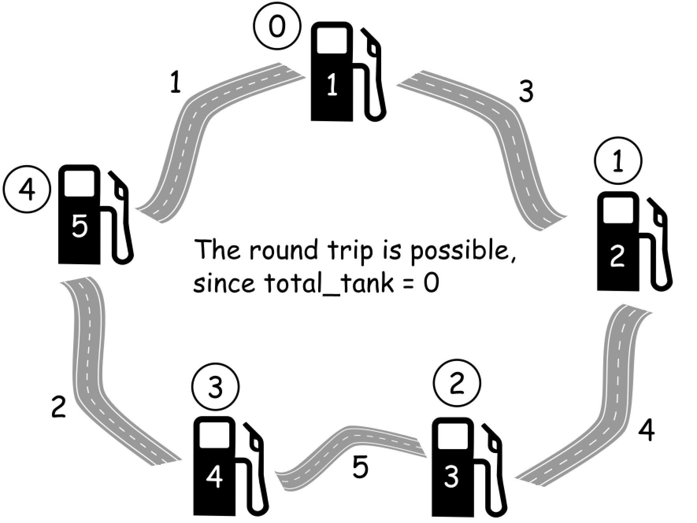
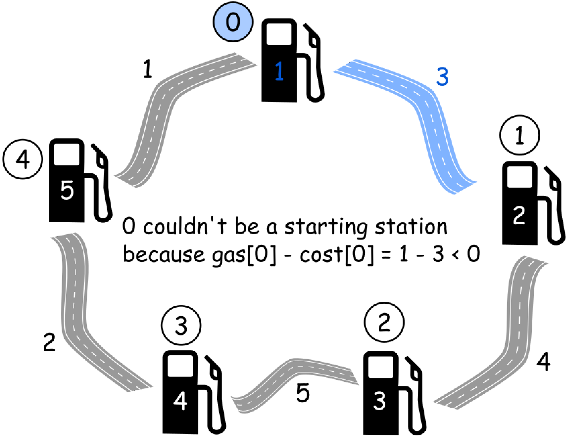

### 134. Gas Station

https://leetcode.com/problems/gas-station/

There are N gas stations along a circular route, where the amount of gas at station i is `gas[i]`.

You have a car with an unlimited gas tank and it costs `cost[i]` of gas to travel from station i to its next station (i+1). You begin the journey with an empty tank at one of the gas stations.

Return the starting gas station's index if you can travel around the circuit once in the clockwise direction, otherwise return -1.

Note:

- If there exists a solution, it is guaranteed to be unique.
- Both input arrays are non-empty and have the same length.
- Each element in the input arrays is a non-negative integer.
Example 1:
```
Input: 
gas  = [1,2,3,4,5]
cost = [3,4,5,1,2]

Output: 3

Explanation:
Start at station 3 (index 3) and fill up with 4 unit of gas. Your tank = 0 + 4 = 4
Travel to station 4. Your tank = 4 - 1 + 5 = 8
Travel to station 0. Your tank = 8 - 2 + 1 = 7
Travel to station 1. Your tank = 7 - 3 + 2 = 6
Travel to station 2. Your tank = 6 - 4 + 3 = 5
Travel to station 3. The cost is 5. Your gas is just enough to travel back to station 3.
Therefore, return 3 as the starting index.
```
Example 2:
```
Input: 
gas  = [2,3,4]
cost = [3,4,3]

Output: -1

Explanation:
You can't start at station 0 or 1, as there is not enough gas to travel to the next station.
Let's start at station 2 and fill up with 4 unit of gas. Your tank = 0 + 4 = 4
Travel to station 0. Your tank = 4 - 3 + 2 = 3
Travel to station 1. Your tank = 3 - 3 + 3 = 3
You cannot travel back to station 2, as it requires 4 unit of gas but you only have 3.
Therefore, you can't travel around the circuit once no matter where you start.
```

Solution

Approach 1: 1 Pass
Intuition

The first idea is to check every single station :

- Choose the station as starting point.
- Perform the road trip and check how much gas we have in tank at each station.

That means O(N^2) time complexity, and for sure one could do better.

Let's notice two things.
~~~
It's impossible to perform the road trip if sum(gas) < sum(cost). In this situation the answer is -1.
~~~



One could compute total amount of gas in the tank `total_tank = sum(gas) - sum(cost)` during the round trip, and then return `-1` if `total_tank < 0`.

~~~
It's impossible to start at a station i if gas[i] - cost[i] < 0, because then there is not enough gas in the tank to travel to i + 1 station.
~~~



The second fact could be generalized. Let's introduce curr_tank variable to track the current amount of gas in the tank. If at some station curr_tank is less than 0, that means that one couldn't reach this station.

Next step is to mark this station as a new starting point, and reset curr_tank to zero since one starts with no gas in the tank.

Algorithm

Now the algorithm is straightforward :

1. Initiate total_tank and curr_tank as zero, and choose station 0 as a starting station.

2. Iterate over all stations :

   - Update `total_tank` and `curr_tank` at each step, by adding `gas[i]` and subtracting `cost[i]`.

   - If `curr_tank < 0` at `i + 1` station, make `i + 1` station a new starting point and reset `curr_tank = 0` to start with an empty tank.

3. Return `-1` if `total_tank < 0` and `starting station` otherwise.


Complexity Analysis
- Time complexity: O(n)
- Space complexity: O(1)

```java
class Solution {
  public int canCompleteCircuit(int[] gas, int[] cost) {
    int n = gas.length;

    int total_tank = 0;
    int curr_tank = 0;
    int starting_station = 0;
    for (int i = 0; i < n; ++i) {
      total_tank += gas[i] - cost[i];
      curr_tank += gas[i] - cost[i];
      // If one couldn't get here,
      if (curr_tank < 0) {
        // Pick up the next station as the starting one.
        starting_station = i + 1;
        // Start with an empty tank.
        curr_tank = 0;
      }
    }
    return total_tank >= 0 ? starting_station : -1;
  }
}
```


Approach 2: Greedy

Complexity Analysis

- Time complexity: O(n)

- Space complexity: O(n)

```java
class Solution {
    public int canCompleteCircuit(int[] gas, int[] cost) {
        for(int start = 0; start < gas.length; start++) {
            boolean isExist = dfs(0, start, 0, gas, cost);
            if(isExist) {
                return start;
            }
        }
        return -1;
    }
    
    private boolean dfs(int jumpCount, int curPos, int curHolding, int[] gas, int[] cost) {
        if(curHolding < 0) {
            return false;
        }
        
        if(jumpCount == gas.length) {
            return curHolding >= 0;
        }

        // update current fuel level before moving to next gas station
        int fuelAmount = gas[curPos] + curHolding - cost[curPos];
        int nextPos = (curPos + 1) % gas.length;
            
        return dfs(jumpCount+1, nextPos, fuelAmount, gas, cost);
    }
}
```


