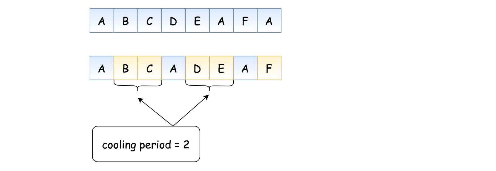
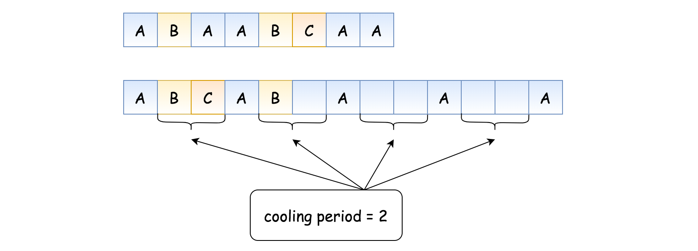
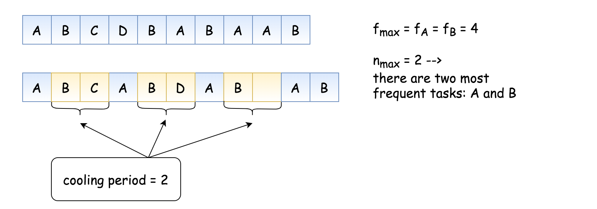

### 621. Task Scheduler

https://leetcode.com/problems/task-scheduler/

Given a char array representing tasks CPU need to do. It contains capital letters A to Z where different letters represent different tasks. Tasks could be done without original order. Each task could be done in one interval. For each interval, CPU could finish one task or just be idle.

However, there is a non-negative cooling interval n that means between two same tasks, there must be at least n intervals that CPU are doing different tasks or just be idle.

You need to return the least number of intervals the CPU will take to finish all the given tasks.

 

Example:
```
Input: tasks = ["A","A","A","B","B","B"], n = 2
Output: 8
Explanation: A -> B -> idle -> A -> B -> idle -> A -> B.
``` 

Constraints:

- The number of tasks is in the range [1, 10000].
- The integer n is in the range [0, 100].


Solution

[Approach 1: Greedy algo](https://leetcode.com/problems/task-scheduler/discuss/104500/Java-O(n)-time-O(1)-space-1-pass-no-sorting-solution-with-detailed-explanation)

The key is to find out how many idles do we need.
Let's first look at how to arrange them. it's not hard to figure out that we can do a "greedy arrangement": always arrange task with most frequency first.
E.g. we have following tasks :

3 A, 2 B, 1 C. and we have n = 2. 

According to what we have above, we should first arrange A, and then B and C. Imagine there are "slots" and we need to arrange tasks by putting them into "slots". Then A should be put into slot 0, 3, 6 since we need to have at least n = 2 other tasks between two A. After A put into slots, it looks like this:

A ? ? A ? ? A
"?" is "empty" slots.

Now we can use the same way to arrange B and C. The finished schedule should look like this:

A B C A B # A
"#" is idle

Now we have a way to arrange tasks. But the problem only asks for number of CPU intervals, so we don't need actually arrange them. Instead we only need to get the total idles we need and the answer to problem is just number of idles + number of tasks.
Same example:

3 A, 2 B, 1 C, n = 2. After 

arranging A, we have:

A ? ? A ? ? A

We can see that A separated slots into (count(A) - 1) = 2 parts, each part has length n. With the fact that A is the task with most frequency, it should need more idles than any other tasks. In this case if we can get how many idles we need to arrange A, we will also get number of idles needed to arrange all tasks. Calculating this is not hard, we first get number of parts separated by A: partCount = count(A) - 1; then we can know number of empty slots: emptySlots = partCount * n; we can also get how many tasks we have to put into those slots: availableTasks = tasks.length - count(A). Now if we have emptySlots > availableTasks which means we have not enough tasks available to fill all empty slots, we must fill them with idles. Thus we have `idles = max(0, emptySlots - availableTasks)`;

Almost done. One special case: what if there are more than one task with most frequency? OK, let's look at another example:

3 A 3 B 2 C 1 D, n = 3

Similarly we arrange A first:

A ? ? ? A ? ? ? A

Now it's time to arrange B, we find that we have to arrange B like this:

A B ? ? A B ? ? A B

we need to put every B right after each A. Let's look at this in another way, think of sequence "A B" as a special task "X", then we got:

X ? ? X ? ? X

Comparing to what we have after arranging A:

A ? ? ? A ? ? ? A

The only changes are length of each parts (from 3 to 2) and available tasks. By this we can get more general equations:

<b>
partCount = count(A) - 1

emptySlots = partCount * (n - (count of tasks with most frequency - 1))

availableTasks = tasks.length - count(A) * count of tasks with most frenquency

idles = max(0, emptySlots - availableTasks)

result = tasks.length + idles</b>

What if we have more than n tasks with most frequency and we got emptySlot negative? Like 3A, 3B, 3C, 3D, 3E, n = 2. In this case seems like we can't put all B C S inside slots since we only have n = 2.

Well partCount is actually the "minimum" length of each part required for arranging A. You can always make the length of part longer.

E.g. 3A, 3B, 3C, 3D, 2E, n = 2.
You can always first arrange A, B, C, D as:

A B C D | A B C D | A B C D

in this case you have already met the "minimum" length requirement for each part (n = 2), you can always put more tasks in each part if you like:
e.g.

A B C D E | A B C D E | A B C D

emptySlots < 0 means you have already got enough tasks to fill in each part to make arranged tasks valid. But as I said you can always put more tasks in each part once you met the "minimum" requirement.

To get count(A) and count of tasks with most frequency, we need to go through inputs and calculate counts for each distinct char. This is O(n) time and O(26) space since we only handle upper case letters.
All other operations are O(1) time O(1) space which give us total time complexity of O(n) and space O(1)


Time complexity: O(n)

Space complexity: O(1)


```java
class Solution {
    public int leastInterval(char[] tasks, int n) {
        int[] chars = new int[26];
        int max = 0;
        int maxCount = 0;
        for(char task: tasks) {
            chars[task - 'A']++;
            if(max == chars[task - 'A']) {
                maxCount++;
            } else if (max < chars[task - 'A']) {
                maxCount = 1;
                max = chars[task - 'A'];
            }
        }
        
        int partCount = (max - 1);
        int emptySlots = partCount * (n - (maxCount - 1));
        int remainTasksCount = tasks.length - max*maxCount;
        int idles = Math.max(0, emptySlots - remainTasksCount);
        return tasks.length + idles;
    }
}
```

##### Approach 2: Math
##### Intuition

Let's use some math to compute the answer. There are two possible situations:

- The most frequent task is not frequent enough to force the presence of idle slots.
  

- The most frequent task is frequent enough to force some idle slots. 

~~~
The answer is the maximum between these two.
~~~

The first situation is straightforward because the total number of slots is defined by the number of tasks: `len(tasks)`.

The second situation is a bit more tricky and requires to know the number `n_max` and the frequency `f_max` of the most frequent tasks.



Now it's easy to compute:


##### Algorithm

- The maximum number of tasks is 26. Let's allocate an array frequencies of 26 elements to keep the frequency of each task.

- Iterate over the input array and store the frequency of task A at index 0, the frequency of task B at index 1, etc.

- Find the maximum frequency: f_max = max(frequencies).

- Find the number of tasks which have the max frequency: n_max = frequencies.count(f_max).

- If the number of slots to use is defined by the most frequent task, it's equal to (f_max - 1) * (n + 1) + n_max.

- Otherwise, the number of slots to use is defined by the overall number of tasks: len(tasks).

- Return the maximum of these two: max(len(tasks), (f_max - 1) * (n + 1) + n_max).


##### Complexity Analysis

- Time Complexity: O(N<sub>total</sub>), where O(N<sub>total</sub>)​	
  is a number of tasks to execute. This time is needed to iterate over the input array tasks and to compute the array frequencies. Array frequencies contains 26 elements, and hence all operations with it takes constant time.

- Space Complexity: O(1), to keep the array frequencies of 26 elements.

```java
class Solution {
    public int leastInterval(char[] tasks, int n) {
        // frequencies of the tasks
        int[] frequencies = new int[26];
        for (int t : tasks) {
            frequencies[t - 'A']++;
        }

        // max frequency
        int f_max = 0;
        for (int f : frequencies) {
            f_max = Math.max(f_max, f);
        }
        
        // count the most frequent tasks
        int n_max = 0;
        for (int f : frequencies) {
            if (f == f_max) n_max++;
        }
        
        return Math.max(tasks.length, (f_max - 1) * (n + 1) + n_max);
    }
}
```
