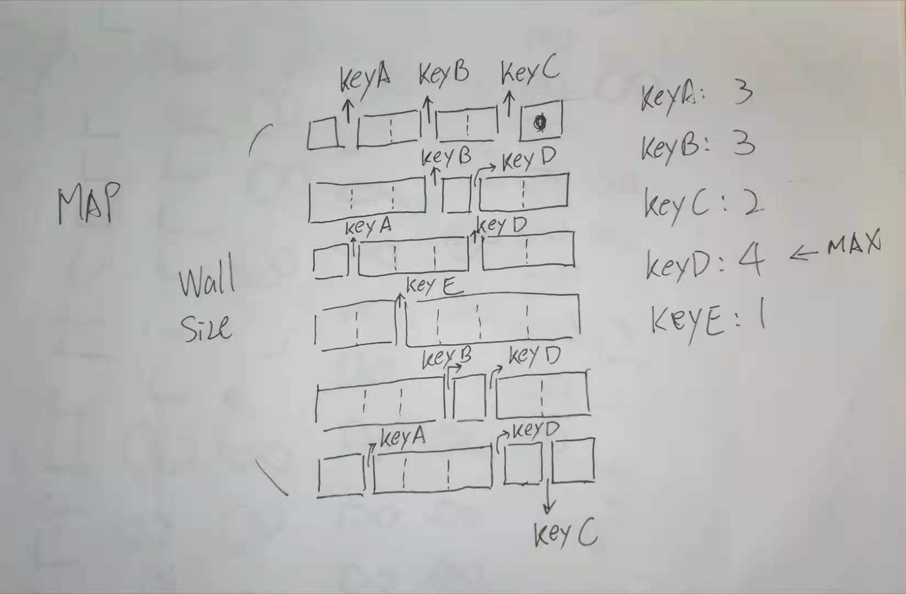

### [554. Brick Wall](https://leetcode.com/problems/brick-wall/)

There is a rectangular brick wall in front of you with n rows of bricks. The ith row has some number of bricks each of the same height (i.e., one unit) but they can be of different widths. The total width of each row is the same.

Draw a vertical line from the top to the bottom and cross the least bricks. If your line goes through the edge of a brick, then the brick is not considered as crossed. You cannot draw a line just along one of the two vertical edges of the wall, in which case the line will obviously cross no bricks.

Given the 2D array wall that contains the information about the wall, return the minimum number of crossed bricks after drawing such a vertical line.

 

Example 1:


```
Input: wall = [[1,2,2,1],[3,1,2],[1,3,2],[2,4],[3,1,2],[1,3,1,1]]
Output: 2
```
Example 2:
```
Input: wall = [[1],[1],[1]]
Output: 3
``` 

Constraints:

- n == wall.length
- 1 <= n <= $10^4$
- 1 <= wall[i].length <= $10^4$
- 1 <= sum(wall[i].length) <= $2 * 10^4$
- sum(wall[i]) is the same for each row i.
- 1 <= wall[i][j] <= $2^{31} - 1$


### Solution

#### Approach 1: HashMap to record each gap index


In each row of Brick Wall, there maybe a brick-edge (where one brick ends and next one starts) at any index from [0, W] (where W is the width of Brick Wall).

Now, to get the least number of intersections, we must draw a line starting at top from some wall index idx such that the number of brick edges at that index is maximum. This will ensure that we have least number of brick intersections.

For this, we can use a hashmap to store each index and map it with frequency of brick edges at that index. This can be done by iterating each row of wall. For each brick-edge on that row, increment frequncy for the corresponding index idx. The next index can be successively found by adding the current brick width to idx

Lastly, we draw a line starting from the brick index where maximum number of brick edges frequency was found.



```java
class Solution {
    public int leastBricks(List<List<Integer>> wall) {
        Map<Integer, Integer> map = new HashMap();
        
        int count = 0;
        for (List<Integer> row : wall) {
            int sum = 0;
            for (int i = 0; i < row.size() - 1; i++) {
                sum += row.get(i);
                map.put(sum, map.getOrDefault(sum, 0) + 1);
                count = Math.max(count, map.get(sum));
            }
        }
        
        return wall.size() - count;
    }
}
```

