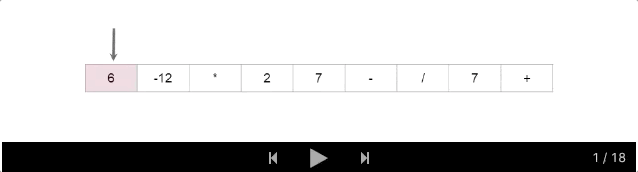

### 150. Evaluate Reverse Polish Notation
https://leetcode.com/problems/evaluate-reverse-polish-notation/

Evaluate the value of an arithmetic expression in Reverse Polish Notation.

Valid operators are +, -, *, /. Each operand may be an integer or another expression.

Note:

- Division between two integers should truncate toward zero.
- The given RPN expression is always valid. That means the expression would always evaluate to a result and there won't be any divide by zero operation.
Example 1:
```
Input: ["2", "1", "+", "3", "*"]
Output: 9
Explanation: ((2 + 1) * 3) = 9
```
Example 2:
```
Input: ["4", "13", "5", "/", "+"]
Output: 6
Explanation: (4 + (13 / 5)) = 6
```
Example 3:
```
Input: ["10", "6", "9", "3", "+", "-11", "*", "/", "*", "17", "+", "5", "+"]
Output: 22
Explanation: 
  ((10 * (6 / ((9 + 3) * -11))) + 17) + 5
= ((10 * (6 / (12 * -11))) + 17) + 5
= ((10 * (6 / -132)) + 17) + 5
= ((10 * 0) + 17) + 5
= (0 + 17) + 5
= 17 + 5
= 22
```
Solution

If you've attempted this question and can't figure out why you're getting wrong answers, here are a couple of things to check before reading the article:

1.  Reverse Polish Notation is not a "reverse" form of Polish Notation. It is a bit different.

2. If you're using Java, note that the input type is an array of strings, not an array of chars. This means that you should be comparing them with .equals(...), not ==. If your code is working on your computer but not on Leetcode, this is probably why. It is a bug in your code, not in the Leetcode platform.

3. Some programming languages (e.g. Python, but not C++ and Java) do not truncate towards 0 with division, so you'll need to figure out how to make them do so (we'll discuss ways in the article). For example, if we put -121 // 7 into Python, we get -18, but we actually wanted -17. If unsure about your programming language, either check the documentation or simply write a program that does -121 / 7 (as integer division) and see which result you get.

4. Did you put numbers around the correct way? e.g. the test case ["12", "7", "-"] means you should calculate 12 - 7 = 5, and not 7 - 12 = -5. In most implementations, getting them the correct way around is not immediately obvious. If you aren't certain you have it right, try this test case (["12", "7", "-]) and check whether you get 5 or -5.

5. At the time of writing this solution article, the Wikipedia article has a number of errors and sections that are confusing (in particular, parsing the list in reverse). Try to understand how Reverse Polish Notation works and then design an algorithm yourself rather than following the provided pseudocode too closely. The Introduction section of this solution article also explains how Reverse Polish Notation works.

##### What is Reverse Polish Notation?

Just like Infix Notation, or in fact any other notation, Reverse Polish Notation has rules for how to evaluate it. You'll need to know these rules before you can write an algorithm. The rules could either be prior knowledge or supplied by an interviewer.

~~~
While there are operators remaining in the list, find the left-most operator. Apply it to the 2 numbers immediately before it, and replace all 3 tokens (the operator and 2 numbers) with the result.
~~~

For example in the most simplest case of 3 4 + when we reach + we can replace 3 4 + with it's result 7.

As long as the input was valid, this rule will always work and leave a single number that should be returned. The leftmost operator that hasn't yet been removed will always have 2 numbers immediately before it.

Here is an animation showing a more complicated example.



Complexity analysis:
- Time complexity: O(n^2)
- Space complexity: O(1)

```java
class Solution {
    
    private static final Map<String, BiFunction<Integer, Integer, Integer>> OPERATIONS = new HashMap<>();
    
    // Ensure this only gets done once for ALL test cases.
    static {
        OPERATIONS.put("+", (a, b) -> a + b);
        OPERATIONS.put("-", (a, b) -> a - b);
        OPERATIONS.put("*", (a, b) -> a * b);
        OPERATIONS.put("/", (a, b) -> a / b);
    }
    
    public int evalRPN(String[] tokens) {
        
        int currentPosition = 0;
        int length = tokens.length; // We need to keep track of this ourselves.
        
        while (length > 1) {
            
            // Move the position pointer to the next operator token.
            while (!OPERATIONS.containsKey(tokens[currentPosition])) {
                currentPosition++;
            }
            
            // Extract the operation and numbers to apply operation too.
            String operation = tokens[currentPosition];
            int number1 = Integer.parseInt(tokens[currentPosition - 2]);
            int number2 = Integer.parseInt(tokens[currentPosition - 1]);
            
            // Calculate the result to overwrite the operator with.
            BiFunction<Integer, Integer, Integer> operator = OPERATIONS.get(operation);
            int value = operator.apply(number1, number2);
            tokens[currentPosition] = Integer.toString(value);
            
            // Delete numbers and point pointers correctly.
            delete2AtIndex(tokens, currentPosition - 2, length);
            currentPosition--;
            length -= 2;
        } 
        
        return Integer.parseInt(tokens[0]);
    }
    
    private void delete2AtIndex(String[] tokens, int d, int length) {
        for (int i = d; i < length - 2; i++) {
            tokens[i] = tokens[i + 2];
        }
    }
}
```

##### Approach 2: Evaluate with Stack
Complexity analysis:
- Time complexity: O(n)
- Space complexity: O(n)

```java
class Solution {
    
    private static final Map<String, BiFunction<Integer, Integer, Integer>> OPERATIONS = new HashMap<>();
    
    // Ensure this only gets done once for ALL test cases.
    static {
        OPERATIONS.put("+", (a, b) -> a + b);
        OPERATIONS.put("-", (a, b) -> a - b);
        OPERATIONS.put("*", (a, b) -> a * b);
        OPERATIONS.put("/", (a, b) -> a / b);
    }
    
    public int evalRPN(String[] tokens) {

        Stack<Integer> stack = new Stack<>();

        for (String token : tokens) {
            
            if (!OPERATIONS.containsKey(token)) {
                stack.push(Integer.valueOf(token));
                continue;
            }
            
            int number2 = stack.pop();
            int number1 = stack.pop();
            BiFunction<Integer, Integer, Integer> operation;
            operation = OPERATIONS.get(token);
            int result = operation.apply(number1, number2);
            stack.push(result);
        }
        
        return stack.pop();
        
    }
}
```

```java
class Solution {
    
    public int evalRPN(String[] tokens) {
        
        Stack<Integer> stack = new Stack<>();
        
        for (String token : tokens) {
            
            if (!"+-*/".contains(token)) {
                stack.push(Integer.valueOf(token));
                continue;
            }
            
            int number2 = stack.pop();
            int number1 = stack.pop();
            
            int result = 0;
            
            switch (token) {
                case "+":
                    result = number1 + number2;
                    break;
                case "-":
                    result = number1 - number2;
                    break;
                case "*":
                    result = number1 * number2;
                    break;
                case "/":
                    result = number1 / number2;
                    break;
            }
            
            stack.push(result);
            
        }
        
        return stack.pop();
    }
}
```