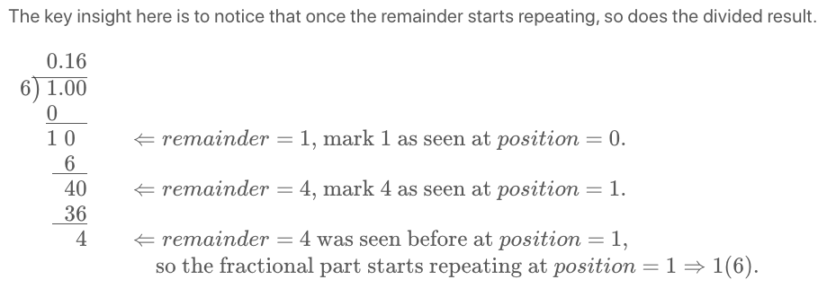
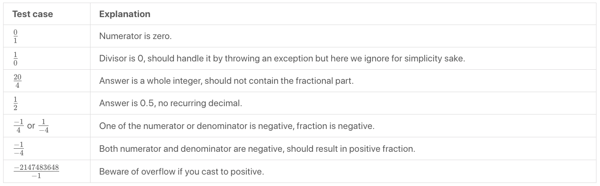

### [166. Fraction to Recurring Decimal](https://leetcode.com/problems/fraction-to-recurring-decimal/)


Given two integers representing the `numerator` and `denominator` of a fraction, return the fraction in string format.

If the fractional part is repeating, enclose the repeating part in parentheses.

If multiple answers are possible, return **any of them**.

It is guaranteed that the length of the answer string is less than 10^4 for all the given inputs.

 

Example 1:
```
Input: numerator = 1, denominator = 2
Output: "0.5"
```
Example 2:
```
Input: numerator = 2, denominator = 1
Output: "2"
```
Example 3:
```
Input: numerator = 2, denominator = 3
Output: "0.(6)"
```
Example 4:
```
Input: numerator = 4, denominator = 333
Output: "0.(012)"
```
Example 5:
```
Input: numerator = 1, denominator = 5
Output: "0.2"
``` 

Constraints:

- $-2 ^ {31} <= numerator, denominator <= 2^{31} - 1$
- denominator != 0

##### Solution

##### Approach 1: Long Division
##### Intuitition
1. No scary math, just apply elementary math knowledge. Still remember how to perform a long division?
2. Try a long division on $\dfrac{4}{9}$​ , the repeating part is obvious. Now try $\dfrac{4}{333}$. Do you see a pattern?
3. Be wary of edge cases! List out as many test cases as you can think of and test your code thoroughly.


##### Complexity Analysis
- Time complexity:
- Space complexity:

##### Algorithm

You will need a hash table that maps from the remainder to its position of the fractional part. Once you found a repeating remainder, you may enclose the reoccurring fractional part with parentheses by consulting the position from the table.

The remainder could be zero while doing the division. That means there is no repeating fractional part and you should stop right away.

Just like the question Divide Two Integers, be wary of edge cases such as negative fractions and nasty extreme case such as $\dfrac{-2147483648}{-1}$
​
 
```java
public class Solution {
    public String fractionToDecimal(int numerator, int denominator) {
        if (numerator == 0) {
            return "0";
        }
        StringBuilder res = new StringBuilder();
        // "+" or "-"
        res.append(((numerator > 0) ^ (denominator > 0)) ? "-" : "");
        long num = Math.abs((long)numerator);
        long den = Math.abs((long)denominator);
        
        // integral part
        res.append(num / den);
        num %= den;
        if (num == 0) {
            return res.toString();
        }
        
        // fractional part
        res.append(".");
        HashMap<Long, Integer> map = new HashMap<Long, Integer>();
        map.put(num, res.length());
        while (num != 0) {
            num *= 10;
            res.append(num / den);
            num %= den;
            if (map.containsKey(num)) {
                int index = map.get(num);
                res.insert(index, "(");
                res.append(")");
                break;
            } else {
                map.put(num, res.length());
            }
        }
        return res.toString();
    }
}
```