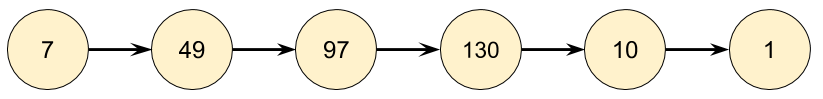
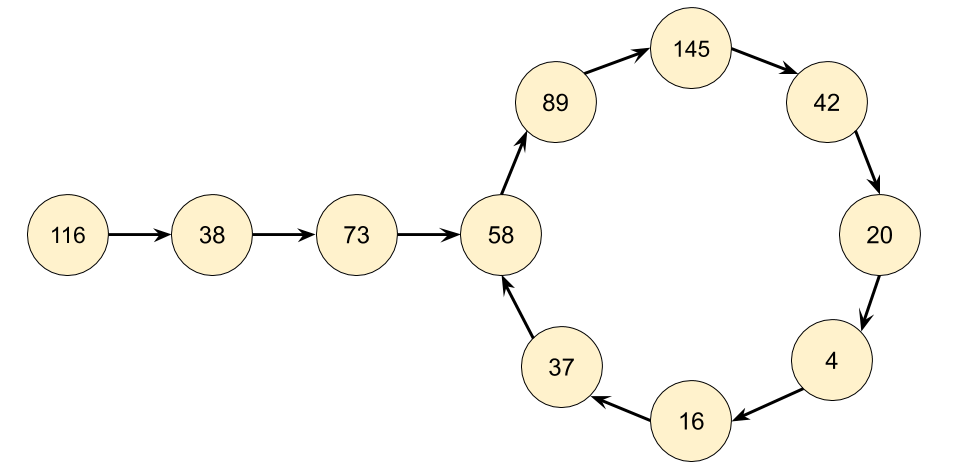
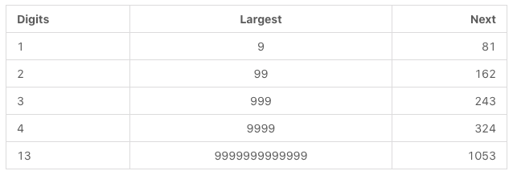
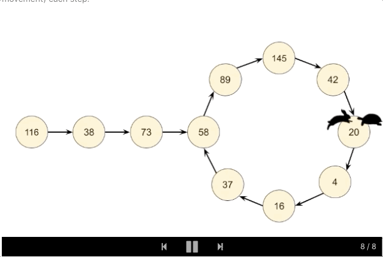

### 202. Happy Number

Write an algorithm to determine if a number is "happy".

A happy number is a number defined by the following process: Starting with any positive integer, replace the number by the sum of the squares of its digits, and repeat the process until the number equals 1 (where it will stay), or it loops endlessly in a cycle which does not include 1. Those numbers for which this process ends in 1 are happy numbers.

Example: 
```
Input: 19
Output: true
Explanation: 
12 + 92 = 82
82 + 22 = 68
62 + 82 = 100
12 + 02 + 02 = 1
```
Solution

##### Approach 1: Detect Cycles with a HashSet
Intuition

A good way to get started with a question like this is to make a couple of examples. Let's start with the number 77. The next number will be 4949 (as 7^2 = 49 ), and then the next after that will be 97 (as 4^2 + 9^2 = 97). We can continually repeat the process of squaring and then adding the digits until we get to 11. Because we got to 1, we know that 7 is a happy number, and the function should return true.


As another example, let's start with 116. By repeatedly applying the squaring and adding process, we eventually get to 58, and then a bit after that, we get back to 58. Because we are back at a number we've already seen, we know there is a cycle, and therefore it is impossible to ever reach 1. So for 116, the function should return false.


Based on our exploration so far, we'd expect continually following links to end in one of three ways.

1. It eventually gets to 1.
2. It eventually gets stuck in a cycle.
3. It keeps going higher and higher, up towards infinity.

That 3rd option sounds really annoying to detect and handle. How would we even know that it is going to continue going up, rather than eventually going back down, possibly to 1? Luckily, it turns out we don't need to worry about it. Think carefully about what the largest next number we could get for each number of digits is.



For a number with 3 digits, it's impossible for it to ever go larger than 243. This means it will have to either get stuck in a cycle below 243 or go down to 1. Numbers with 4 or more digits will always lose a digit at each step until they are down to 3 digits. So we know that at worst, the algorithm might cycle around all the numbers under 243 and then go back to one it's already been to (a cycle) or go to 1. But it won't go on indefinitely, allowing us to rule out the 3rd option.

Even though you don't need to handle the 3rd case in the code, you still need to understand why it can never happen, so that you can justify why you didn't handle it.

##### Algorithm

There are 2 parts to the algorithm we'll need to design and code.

1. Given a number nn, what is its next number?
2. Follow a chain of numbers and detect if we've entered a cycle.

Part 1 can be done by using the division and modulus operators to repeatedly take digits off the number until none remain, and then squaring each removed digit and adding them together. Have a careful look at the code for this, "picking digits off one-by-one" is a useful technique you'll use for solving a lot of different problems.

Part 2 can be done using a HashSet. Each time we generate the next number in the chain, we check if it's already in our HashSet.

- If it is not in the HashSet, we should add it.
- If it is in the HashSet, that means we're in a cycle and so should return false.

The reason we use a HashSet and not a Vector, List, or Array is because we're repeatedly checking whether or not numbers are in it. Checking if a number is in a HashSet takes O(1) time, whereas for the other data structures it takes O(n) time. Choosing the correct data structures is an essential part of solving these problems.


##### Complexity analysis
Determining the time complexity for this problem is challenging for an "easy" level question. If you're new to these problems, have a go at calculating the time complexity for just the getNext(n) function (don't worry about how many numbers will be in the chain).


- Time complexity: O(243 * 3 + log n + loglogn + logloglogn) = O(logn)
  Finding the **next** value for a given number has a cost of O(logn) because we are processing each digit in the number, and the number of digits in a number is given by logn.
 
  To work out the total time complexity, we'll need to think carefully about how many numbers are in the chain, and how big they are.

  We determined above that once a number is below 243, it is impossible for it to go back up above 243. Therefore, based on our very shallow analysis we know for sure that once a number is below 243, it is impossible for it to take more than another 243 steps to terminate. Each of these numbers has at most 3 digits. With a little more analysis, we could replace the 243 with the length of the longest number chain below 243, however because the constant doesn't matter anyway, we won't worry about it.
  For an nn above 243, we need to consider the cost of each number in the chain that is above 243. With a little math, we can show that in the worst case, these costs will be O(logn) + O(loglogn)+O(logloglogn).... Luckily for us, the O(logn) is the dominating part, and the others are all tiny in comparison (collectively, they add up to less than logn), so we can ignore them.

- Space complexity : O(logn). Closely related to the time complexity, and is a measure of what numbers we're putting in the HashSet, and how big they are. For a large enough nn, the most space will be taken by nn itself.

We can optimize to O(243 * 3) = O(1) easily by only saving numbers in the set that are less than 243, as we have already shown that for numbers that are higher, it's impossible to get back to them anyway.

```java
class Solution {

    private int getNext(int n) {
        int totalSum = 0;
        while (n > 0) {
            int d = n % 10;
            n = n / 10;
            totalSum += d * d;
        }
        return totalSum;
    }

    public boolean isHappy(int n) {
        Set<Integer> seen = new HashSet<>();
        while (n != 1 && !seen.contains(n)) {
            seen.add(n);
            n = getNext(n);
        }
        return n == 1;
    }
}
```

Approach 2: Floyd's Cycle-Finding Algorithm


##### Complexity analysis
- Time complexity: O(logn)
- Space complexity: O(1)

```java
class Solution {

     public int getNext(int n) {
        int totalSum = 0;
        while (n > 0) {
            int d = n % 10;
            n = n / 10;
            totalSum += d * d;
        }
        return totalSum;
    }

    public boolean isHappy(int n) {
        int slowRunner = n;
        int fastRunner = getNext(n);
        while (fastRunner != 1 && slowRunner != fastRunner) {
            slowRunner = getNext(slowRunner);
            fastRunner = getNext(getNext(fastRunner));
        }
        return fastRunner == 1;
    }
}
```
