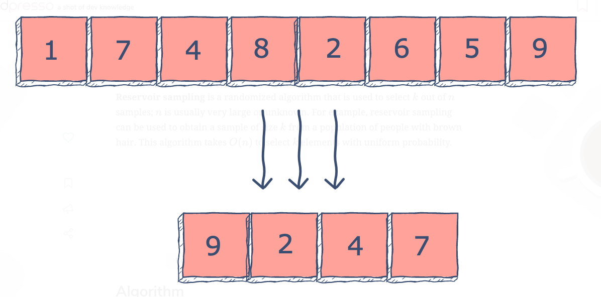

### [What is reservoir sampling?](https://www.educative.io/edpresso/what-is-reservoir-sampling)


**Reservoir sampling** is a randomized algorithm that is used to select k out of n samples; n is usually very large or unknown. For example, reservoir sampling can be used to obtain a sample of size k from a population of people with brown hair. This algorithm takes O(n) to select k elements with uniform probability.



`Reservoir sampling is used to randomly take k out n samples. Here k = 4.`

### Algorithm
1. Copy the first k elements from the input array to the output array.

2. Iterate from k to n−1 (both inclusive). In each iteration jj:

   - Generate a random number numnum from 0 to j.

   - If numnum is less than k, replace the element at index numnum in the output array with the item at index j in the input array.


### Explaination


Code

```java
// Importing dependancies
import java.util.Random;
import java.util.Arrays; 
class HelloWorld {
    public static void main( String args[] ) {
      // Defining the parameters
      int n = 8;
      int k = 4;
      // The array to be smaples
      int input[] = {1, 7, 4, 8, 2, 6, 5, 9};
      int output[] = new int[k];
      int i;
      // Initialzing the output array to the first k
      // elements of the input array
      for(i = 0; i < k; i++){
        output[i] = input[i];
      }
      int j;
      Random num = new Random();
      // Iterating from k to n-1
      for(j = i; j < n; j++){
        // Generating a randon number from 0 to j
        int index = num.nextInt(j + 1);
        // Replacing an element in the  output with an element
        // in the input if the randomly generated number is less
        // than k.
        if(index < k){
          output[index] = input[j];
        }
      }
      System.out.println("Input array:");
      System.out.println(Arrays.toString(input));
      System.out.println("Output array:");
      System.out.println(Arrays.toString(output));
        
    }
}
```

---
Explanation from Leetcode

<div class="discuss-markdown-container"><p></p><h3>Problem:</h3>
<ul>
<li>Choose <code>k</code> entries from <code>n</code> numbers. Make sure each number is selected with the probability of <code>k/n</code></li>
</ul>
<h3>Basic idea:</h3>
<ul>
<li>Choose <code>1, 2, 3, ..., k</code> first and put them into the reservoir.</li>
<li>For <code>k+1</code>, pick it with a probability of <code>k/(k+1)</code>, and randomly replace a number in the reservoir.</li>
<li>For <code>k+i</code>, pick it with a probability of <code>k/(k+i)</code>, and randomly replace a number in the reservoir.</li>
<li>Repeat until <code>k+i</code> reaches <code>n</code></li>
</ul>
<h3>Proof:</h3>
<ul>
<li>For <code>k+i</code>, the probability that it is selected and will replace a number in the reservoir is <code>k/(k+i)</code></li>
<li>For a number in the reservoir before (let's say <code>X</code>), the probability that it keeps staying in the reservoir is
<ul>
<li><code>P(X was in the reservoir last time)</code> × <code>P(X is not replaced by k+i)</code></li>
<li>= <code>P(X was in the reservoir last time)</code> × (<code>1</code> - <code>P(k+i is selected and replaces X)</code>)</li>
<li>= <code>k/(k+i-1)</code> × （<code>1</code> - <code>k/(k+i)</code> × <code>1/k</code>）</li>
<li>= <code>k/(k+i)</code></li>
</ul>
</li>
<li>When <code>k+i</code> reaches <code>n</code>, the probability of each number staying in the reservoir is <code>k/n</code></li>
</ul>
<h3>Example</h3>
<ul>
<li>Choose <code>3</code> numbers from <code>[111, 222, 333, 444]</code>. Make sure each number is selected with a probability of <code>3/4</code></li>
<li>First, choose <code>[111, 222, 333]</code> as the initial reservior</li>
<li>Then choose <code>444</code> with a probability of <code>3/4</code></li>
<li>For <code>111</code>, it stays with a probability of
<ul>
<li><code>P(444 is not selected)</code> + <code>P(444 is selected but it replaces 222 or 333)</code></li>
<li>= <code>1/4</code> + <code>3/4</code>*<code>2/3</code></li>
<li>= <code>3/4</code></li>
</ul>
</li>
<li>The same case with <code>222</code> and <code>333</code></li>
<li>Now all the numbers have the probability of <code>3/4</code> to be picked</li>
</ul>
<h3>This Problem </h3>
<ul>
<li>This problem(linked list random node) is the sp case where <code>k=1</code></li>
</ul>
<hr>
<p></p></div>