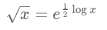
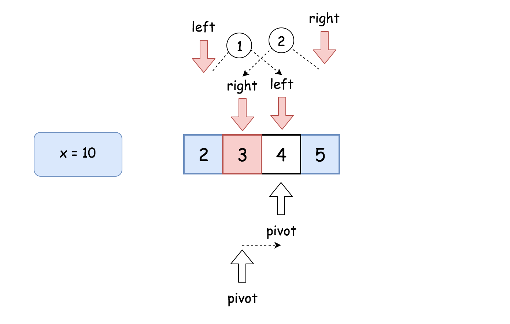
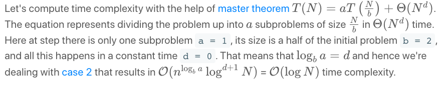
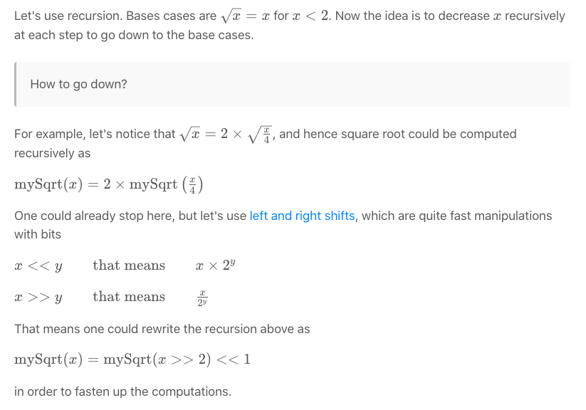
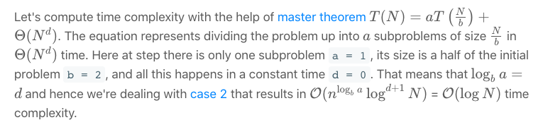

<script type="text/javascript"
        src="https://cdnjs.cloudflare.com/ajax/libs/mathjax/2.7.0/MathJax.js?config=TeX-AMS_CHTML"></script>
<script type="text/x-mathjax-config">
MathJax.Hub.Config({
tex2jax: {
inlineMath: [['$','$'], ['\\(','\\)']],
processEscapes: true},
jax: ["input/TeX","input/MathML","input/AsciiMath","output/CommonHTML"],
extensions: ["tex2jax.js","mml2jax.js","asciimath2jax.js","MathMenu.js","MathZoom.js","AssistiveMML.js", "[Contrib]/a11y/accessibility-menu.js"],
TeX: {
extensions: ["AMSmath.js","AMSsymbols.js","noErrors.js","noUndefined.js"],
equationNumbers: {
autoNumber: "AMS"
}
}
});
</script>

### 69. Sqrt(x)
https://leetcode.com/problems/sqrtx/

Implement int sqrt(int x).

Compute and return the square root of x, where x is guaranteed to be a non-negative integer.

Since the return type is an integer, the decimal digits are truncated and only the integer part of the result is returned.

Example 1:
```
Input: 4
Output: 2
```
Example 2:
```
Input: 8
Output: 2
Explanation: The square root of 8 is 2.82842..., and since 
             the decimal part is truncated, 2 is returned.
```

Solution

##### Approach 1: Pocket Calculator Algorithm


##### Complexity analysis
- Time complexity: O(1)
- Space complexity: O(1)

```java
class Solution {
  public int mySqrt(int x) {
    if (x < 2) return x;

    int left = (int)Math.pow(Math.E, 0.5 * Math.log(x));
    int right = left + 1;
    return (long)right * right > x ? left : right;
  }
}
```

##### Approach 2: Binary Search


##### Complexity analysis
- Time complexity: O(logN)
  
- Space complexity: O(1)

```java
class Solution {
  public int mySqrt(int x) {
    if (x < 2) return x;

    long num;
    int pivot, left = 2, right = x / 2;
    while (left <= right) {
      pivot = left + (right - left) / 2;
      num = (long)pivot * pivot;
      if (num > x) {
          right = pivot - 1;
      } else if (num < x) {
          left = pivot + 1;
      } else {
          return pivot;
      }
    }

    return right;
  }
}
```

##### Approach 3: Recursion + Bit Shifts
##### Intuition


##### Complexity analysis
- Time complexity: O(logN)
  
- Space complexity: O(logN)
```java
class Solution {
  public int mySqrt(int x) {
    if (x < 2) return x;

    int left = mySqrt(x >> 2) << 1;
    int right = left + 1;
    return (long)right * right > x ? left : right;
  }
}
```

##### Approach 4: Newton's Method
https://en.wikipedia.org/wiki/Newton%27s_method

##### Complexity analysis
- Time complexity: O(logN)
- Space complexity: O(1)

```java
class Solution {
  public int mySqrt(int x) {
    if (x < 2) return x;

    double x0 = x;
    double x1 = (x0 + x / x0) / 2.0;
    while (Math.abs(x0 - x1) >= 1) {
      x0 = x1;
      x1 = (x0 + x / x0) / 2.0;
    }

    return (int)x1;
  }
}
```
