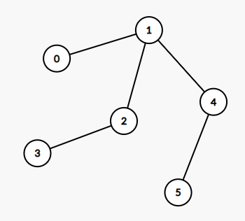

### 1245. Tree Diameter

https://leetcode.com/problems/tree-diameter/

Given an undirected tree, return its diameter: the number of **edges** in a longest path in that tree.

The tree is given as an array of `edges` where `edges[i] = [u, v]` is a bidirectional edge between nodes `u` and `v`.  Each node has labels in the set `{0, 1, ..., edges.length}`.

 

Example 1:


```
Input: edges = [[0,1],[0,2]]
Output: 2
Explanation: 
A longest path of the tree is the path 1 - 0 - 2.
```

Example 2:

```
Input: edges = [[0,1],[1,2],[2,3],[1,4],[4,5]]
Output: 4
Explanation: 
A longest path of the tree is the path 3 - 2 - 1 - 4 - 5.
``` 

Constraints:

- 0 <= edges.length < 10^4
- edges[i][0] != edges[i][1]
- 0 <= edges[i][j] <= edges.length
- The given edges form an undirected tree.


```java
class Solution {
    public int treeDiameter(int[][] edges) {
        // init graph with adjacecy matrix
        int nodesCount = edges.length + 1;
        List<Integer>[] graph = new List[nodesCount];
        // Each node has labels in the set {0, 1, ..., edges.length}.
        for(int i = 0; i < nodesCount; i++) {
            graph[i] = new LinkedList<Integer>();    
        }

        for(int[] edge: edges) {
            graph[edge[0]].add(edge[1]);
            graph[edge[1]].add(edge[0]);
        }
        
        int[] diameter = new int[1];
        depth(0, -1, diameter, graph);
        return diameter[0];
    }
    
    // dfs to find depth
    private int depth(int root, int parent, int[] diameter, List<Integer>[] graph) {
        int maxDepthLen = 0;
        int sndDepthLen = 0;
        for(int child: graph[root]) {
            if(child == parent) {
                continue;
            }
            int depth = depth(child, root, diameter, graph);
            if(depth > maxDepthLen) {
                sndDepthLen = maxDepthLen;
                maxDepthLen = depth;
            } else if(depth > sndDepthLen) {
                sndDepthLen = depth;
            }
        }
        diameter[0] = Math.max(diameter[0], maxDepthLen + sndDepthLen);
        return maxDepthLen + 1;
    }
}
```